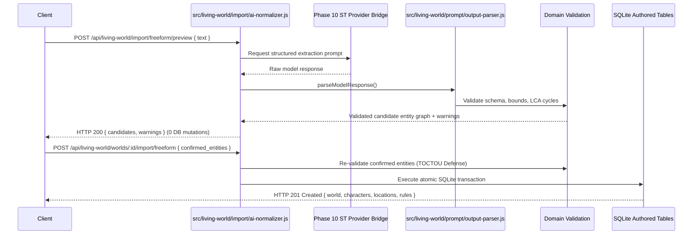

# Phase 11 Planning Artifact: Import, Normalization, and Authoring Workflow

## Status

**READY FOR USER REVIEW**

> [!IMPORTANT]
> **Implementation Authorization Gate:**
> Phase 11 implementation is **NOT** authorized by this planning task. Explicit user authorization of this completed planning document is required before implementation begins.

---

## 1. Planning Metadata & Repository State

- **Target Subsystem:** Living World Simulator (LWS) Native Subsystem
- **Host Fork:** `DaviPiyu148/SillyTavern`, target branch `release`
- **Current Schema Version:** `PRAGMA user_version = 9` (Migration 009 applied)
- **Phase 10 Status:** `IMPLEMENTED, VERIFIED, ACCEPTED`
- **Phase 11 Status in Project State:** `DESIGNED` (Not started)
- **Planning Artifact Revision:** Final Corrective Audit
- **Source Control State:** This planning document is committed to the local working branch `release` (commit `73e6e79a40232cb81733c187f6cb6e229c4f50a2` and predecessor `2173a757c36c01f6a9ecb05a1e03a4fe629fb247`), which is currently local/unpublished relative to `origin/release` (`63668f0a1bc6f4771eba343a07a94459835fe62a`).

---

## 2. Phase Goal

Make existing SillyTavern and AI-RP content (Character Cards V1/V2/V3 in PNG/JSON, World Info / Lorebooks, Canonical LWS World Manifests, and Freeform text) fully usable in the Living World Simulator (LWS) by establishing a deterministic, provenance-preserving normalization pipeline, robust conflict detection, an AI-assisted normalization option, and a comprehensive authored bundle workflow—while strictly preserving the architectural boundary that external and model-generated content is untrusted and never directly mutates runtime simulation state.

---

## 3. Scope Distinction: Original Roadmap vs. Implementation-Level Design Enhancements

To maintain complete architectural transparency, Phase 11 distinguishes original roadmap requirements from implementation-level design enhancements:

### 3.1 Original Roadmap Scope (from `PHASE_DEVELOPMENT_PLAN.md`)
- Character Card import;
- World Info / lorebook import;
- Freeform world / scenario import;
- AI-assisted normalization;
- Provenance preservation;
- Conflict detection;
- Review / confirmation for ambiguous transformations;
- Authored world / character creation workflow.

### 3.2 Implementation-Level Design Enhancements
- **Enhancement A — Canonical LWS World Manifest (`lws_world_manifest_v1`):** A formalized multi-entity JSON/YAML interchange specification enabling atomic, lossless export and import of complete Worlds with hierarchical locations, factions, rules, scenarios, ambient archetypes, and prompt configs.
- **Enhancement B — Full V1/V2/V3 PNG Chunk Extraction:** Reusing SillyTavern host infrastructure to extract both `ccv3` and `chara` PNG `tEXt` chunks with precedence ordering.
- **Enhancement C — TOCTOU Stale-Preview Defense:** Transaction-level re-validation preventing race conditions between advisory preview and final commit.

---

## 4. Non-Goals

- **UI / Frontend Implementation:** User interface screens, drawers, drag-and-drop file upload dialogs, and visual preview modals belong strictly to **Phase 12: Native SillyTavern User Workflow and UI**.
- **Runtime Simulation Mutation:** Importing a card or world NEVER instantiates a simulation or mutates `lws_simulations`, `lws_simulation_characters`, or `lws_events`.
- **Long-Run Regression Suites & Release Packaging:** Full-suite soak testing, disaster recovery, and release backup packaging belong strictly to **Phase 13: Replay, Hardening, Release Readiness, and Long-Run Verification**.
- **Automated Directory Sync:** LWS does not maintain an automated background file-watcher or live sync over SillyTavern's `data/default-user/characters/` folder; all imports are explicit, intentional user/API actions.
- **Optional Archive Formats:** BYAF (`.byaf`) multi-character packs and CharX (`.charx`) archive packages with embedded voice/sprite packs are explicitly deferred to future releases.
- **Core ST Refactoring:** Modifying SillyTavern's host card parsers (`src/character-card-parser.js`) or validator files (`src/validator/TavernCardValidator.js`) outside LWS boundaries.

---

## 5. Architectural Invariants

1. **$\mathbf{LLM / External\ Proposes \to Simulation\ Engine\ Decides \to Database\ Records\ Reality \to Narrative\ Presents\ Reality}$:** External content and AI-generated normalization outputs are untrusted proposals that must pass schema and domain validation before entering the database.
2. **Authored vs. Runtime Separation (Domain Rules 5–7, ADR-006):** Authored data is static, reusable, and simulation-independent. Phase 11 mutates ONLY authored tables. It **NEVER** mutates runtime simulation tables (`lws_simulations`, `lws_simulation_characters`, `lws_events`, etc.).
3. **Provenance Preservation (Domain Rule 37, ADR-009):** Original source, format version, source filename/hash, mapping decisions, dropped properties, and warnings are permanently preserved.
4. **Missing Data Invariant (Domain Rule 37):** Missing fields remain missing (empty string/array or null). Normalization must never hallucinate or invent detail merely to populate optional schema fields.
5. **Lore is Not Physical Reality (Domain Rule 10, IMPORT_AND_NORMALIZATION.md):** Arbitrary lorebook text, background descriptions, and flavor lore do not automatically become physical world constraints or authoritative world rules.
6. **Non-Omniscience & Security (Domain Rules 8–13, 37–39):** Untrusted input parsing must defend against prototype pollution, path traversal, regex DoS, oversized payloads, and circular location hierarchies.

---

## 6. Comprehensive Schema & Column Audit

### 6.1 Column-by-Column Table Audit

The repository database schema was inspected in `src/living-world/migrations/002_authored_model.js` and `src/living-world/migrations/009_environment_and_population.js`:

| Table Name | Entity Class | Schema Migration | Columns Present in Repository | Has `extensions` Column? |
|---|---|---|---|:---:|
| `lws_worlds` | Root Entity | 002 | `id`, `lws_id`, `name`, `description`, `tags`, `extensions`, `created_at`, `updated_at`, `deleted_at` | **YES** |
| `lws_characters` | Authored Entity | 002 | `id`, `lws_id`, `world_id`, `name`, `description`, `personality`, `scenario_context`, `mes_example`, `author_notes`, `system_prompt_override`, `source_version`, `tags`, `extensions`, `created_at`, `updated_at`, `deleted_at` | **YES** |
| `lws_locations` | Authored Entity | 002 | `id`, `lws_id`, `world_id`, `parent_location_id`, `name`, `description`, `tags`, `extensions`, `created_at`, `updated_at`, `deleted_at` | **YES** |
| `lws_factions` | Authored Entity | 002 | `id`, `lws_id`, `world_id`, `name`, `description`, `tags`, `extensions`, `created_at`, `updated_at`, `deleted_at` | **YES** |
| `lws_scenarios` | Authored Entity | 002 | `id`, `lws_id`, `world_id`, `name`, `description`, `starting_location_id`, `tags`, `extensions`, `created_at`, `updated_at`, `deleted_at` | **YES** |
| `lws_authored_prompt_configs` | Authored Config | 002 | `id`, `lws_id`, `world_id`, `style_notes`, `tone_notes`, `format_notes`, `extensions`, `created_at`, `updated_at` | **YES** |
| `lws_world_rules` | Authored Rule | 002 | `id`, `lws_id`, `world_id`, `sort_order`, `title`, `body`, `created_at`, `updated_at`, `deleted_at` | **NO** |
| `lws_character_factions` | Join Table | 002 | `character_id`, `faction_id`, `role` | **NO** |
| `lws_scenario_characters` | Join Table | 002 | `scenario_id`, `character_id`, `role` | **NO** |
| `lws_ambient_archetypes` | Authored Archetype | 009 | `id`, `lws_id`, `world_id`, `archetype_key`, `entity_kind`, `role_title`, `name_pool`, `description_template`, `default_activities`, `location_tags`, `time_windows`, `weather_compat`, `spawn_weight`, `max_concurrent_instances`, `created_at`, `updated_at`, `deleted_at` | **NO** |

### 6.2 Stable Provenance Keys Architecture

To guarantee lossless provenance without database schema changes:
1. **Entities with Dedicated `extensions` Column:**
   - `lws_worlds`, `lws_characters`, `lws_locations`, `lws_factions`, `lws_scenarios`, `lws_authored_prompt_configs` persist provenance directly in `extensions.provenance`.
2. **Entities and Join Tables without `extensions` Column:**
   - **`lws_world_rules`:** Keyed by public UUID `rule.lws_id` inside `lws_worlds.extensions.provenance.imported_components.world_rules[rule.lws_id]`.
   - **`lws_ambient_archetypes`:** Keyed by public UUID `archetype.lws_id` inside `lws_worlds.extensions.provenance.imported_components.ambient_archetypes[archetype.lws_id]`.
   - **`lws_character_factions` (Join Table):** Because join tables have no `lws_id`, provenance is keyed by stable composite public key `"${character_lws_id}:${faction_lws_id}"` inside `lws_worlds.extensions.provenance.imported_components.character_factions["${character_lws_id}:${faction_lws_id}"] = { role, source_entry, imported_at }`.
   - **`lws_scenario_characters` (Join Table):** Keyed by stable composite public key `"${scenario_lws_id}:${character_lws_id}"` inside `lws_worlds.extensions.provenance.imported_components.scenario_characters["${scenario_lws_id}:${character_lws_id}"] = { role, source_entry, imported_at }`.
3. **Relationship Mutation & Re-Import Provenance:**
   - Creation: Added to `imported_components` with creation timestamp and source reference.
   - Deletion / Removal: Recorded in `lws_worlds.extensions.provenance.relationship_mutations: [{ type: 'character_faction_removed', character_lws_id, faction_lws_id, timestamp }]`.
   - Replacement / Re-import: If relationship exists with identical role, logged as idempotent re-import; if role changed, updated and logged in mutation history.
4. **Zero-Schema-Change Proof:** `PRAGMA user_version = 9` is preserved with zero migrations.

---

## 7. Conflict Model: Disambiguating Identity, Semantic, and Normalization Ambiguities

Phase 11 strictly separates three orthogonal classes of conflicts to prevent silent state manipulation:

```mermaid
flowchart TD
    Input[Incoming Import Proposal] --> Check{Conflict Category}
    
    Check -- 1. Identity Collision --> Ident[Active Name Collision]
    Ident --> Policy{User Policy}
    Policy -- REJECT --> Err409[HTTP 409 Conflict]
    Policy -- RENAME --> AutoName[Suffix Name (Import 2)]
    Policy -- REPLACE --> SoftDel[Soft-Delete Old + Insert New]
    Policy -- MERGE --> FieldMerge[Non-Destructive Explicit Field Merge]
    
    Check -- 2. Semantic Conflict --> Sem[Contradictory World Facts]
    Sem --> FlagSem[Log Both Claims in Provenance / Flag for User Preview]
    
    Check -- 3. Normalization Ambiguity --> Amb[Multiple Valid Entity Classes]
    Amb --> FlagAmb[Mark Candidate Ambiguous in Preview / Await User Selection]
```

### 7.1 Category 1: Identity / Name Collisions
Occurs when an imported entity matches the name of an existing active record (`deleted_at IS NULL`) in the target World.
- **`REJECT` (Default):** Returns HTTP 409 Conflict with colliding entity details. 0 DB changes.
- **`RENAME`:** Appends incremental disambiguation suffix: `Name (Import 2)`. Inserts new row with fresh UUID.
- **`REPLACE`:** Soft-deletes existing active record (`deleted_at = isoNow()`). Inserts new record with fresh UUID.
- **`MERGE`:** Non-destructive explicit field merge (detailed below).

### 7.2 Category 2: Semantic Conflicts
Occurs when imported source text contains contradictory factual claims (e.g. Source A: *"The citadel fell in 1042"*, Source B: *"The citadel was never breached"*).
- **Rule:** The normalizer NEVER silently chooses between contradictory factual claims.
- **Behavior:** Both claims are preserved as distinct candidate lore entries or flagged in preview under `semantic_conflicts: [{ field, claim_a, claim_b, source_a, source_b }]` for explicit user arbitration.

### 7.3 Category 3: Normalization / Classification Ambiguity
Occurs when source text could map to multiple valid entity classes (e.g. a lorebook entry describing *"The City Watch"* which could be a Faction, an Ambient Archetype, or a World Rule).
- **Rule:** The normalizer NEVER silently assigns ambiguous entries to authoritative state.
- **Behavior:** The candidate is returned in preview with `ambiguity_flags: [{ entry_uid, candidate_types: ['faction', 'ambient_archetype', 'world_rule'], confidence }]` requiring user selection before persistence.

---

## 8. Non-Destructive Explicit Field Merge Semantics

The merge policy is an **explicit, field-by-field merge** defined as follows:

| Authored Entity | Field | Merge Behavior |
|---|---|---|
| **`lws_characters`** | `name` | Preserved from existing record (never altered). |
| | `description`, `personality`, `scenario_context`, `mes_example`, `author_notes`, `system_prompt_override` | Non-empty imported string updates existing field; empty imported string preserves existing field. |
| | `source_version` | Updated to imported version if non-empty. |
| | `tags` | Set union: `Array.from(new Set([...existingTags, ...importedTags]))`. |
| | `extensions` | Deep object merge (prototype pollution stripped); existing keys preserved, overlapping keys updated. |
| | `extensions.provenance` | Existing provenance preserved; new import record appended to `provenance.import_history: []`. |
| **`lws_locations`** | `name` | Preserved from existing. |
| | `description` | Updated if imported string is non-empty. |
| | `parent_location_id` | Updated ONLY if explicitly specified in imported payload AND validated acyclic; omitted/null leaves existing intact. |
| | `tags`, `extensions` | Set union of tags; deep merge of extensions. |
| **`lws_factions`** | `name` | Preserved from existing. |
| | `description` | Updated if imported non-empty. |
| | `tags`, `extensions` | Set union of tags; deep merge of extensions. |
| **`lws_scenarios`** | `name` | Preserved from existing. |
| | `description` | Updated if imported non-empty. |
| | `starting_location_id` | Updated if explicitly specified; otherwise preserved. |
| | `tags`, `extensions` | Set union of tags; deep merge of extensions. |
| **`lws_world_rules`** | `title`, `body` | Matched by `sort_order` or `title`. Updated if non-empty; `sort_order` preserved unless explicitly reordered. |
| **`lws_authored_prompt_configs`** | `style_notes`, `tone_notes`, `format_notes` | Overwritten if non-empty; extensions deep merged. |
| **`lws_ambient_archetypes`** | `role_title`, `description_template` | Matched by `archetype_key`. Updated if non-empty; `name_pool`, `default_activities`, `location_tags`, `time_windows` merged as set unions. |
| **Join Tables** (`lws_character_factions`, `lws_scenario_characters`) | `role` | Matched by composite key. `role` updated if non-empty in import. |

---

## 9. Active Simulation Safety: Entity-by-Entity Reference Matrix

When an authored record is soft-deleted, replaced, renamed, or merged while referenced by an active running simulation:

| Entity Type | Reference Mechanism in Active Simulation | Behavior on Soft-Delete | Behavior on Replace | Behavior on Rename | Behavior on Merge |
|---|---|---|---|---|---|
| **Character** (`lws_characters`) | Referenced by `lws_simulation_characters.character_id` (integer FK). Frozen copy stored in `lws_simulation_characters.authored_snapshot`. | Simulation continues reading frozen snapshot and historical integer row ID. Trigger `trg_lws_sim_chars_authored_snapshot_immutable` prevents snapshot mutation. | Replaced row soft-deleted; historical integer FK remains valid in SQLite. In-flight simulation unaffected. New simulations see fresh row. | Simulation character reads frozen snapshot; runtime behavior unchanged. | Simulation character retains frozen instantiation snapshot. If runtime requires authored refresh, explicit director command required. |
| **World** (`lws_worlds`) | Referenced by `lws_simulations.world_id` (integer FK). Trigger `trg_lws_simulations_world_id_immutable` prevents FK change. | Soft-deleted world returns 404 on parent endpoints; active child simulation rows remain physically intact in DB. | Old world soft-deleted; running simulation bound to historical world ID remains valid. | Simulation references integer FK; world display name updates for observer perspective if queried live. | Settings/extensions merged; running simulations unaffected. |
| **Location** (`lws_locations`) | Referenced by `lws_simulation_characters.current_location_id` and `lws_events.location_id`. | Triggers `trg_lws_sim_chars_location_update` and `trg_lws_events_same_world_location` allow existing assignments to persist but block *new* movements to soft-deleted locations. | Existing character locations preserved; new pathfinding routes exclude soft-deleted location. | Live observer location name updates; character coordinates/topology intact. | Operational state/description updated; ongoing simulations inherit updated environment baseline if re-evaluated. |
| **Faction** (`lws_factions`) | Referenced by `lws_character_faction_memberships.faction_id`. | Runtime memberships (`lws_character_faction_memberships`) hold snapshots of faction name/standing; soft-deletion of authored faction does not drop runtime rows. | Old faction soft-deleted; runtime faction state preserved. | Runtime memberships update display name if queried live. | Authored faction description updated; runtime standings intact. |
| **Scenario** (`lws_scenarios`) | Referenced by `lws_simulations.scenario_id` (optional integer FK). Trigger `trg_lws_simulations_scenario_id_immutable` prevents FK mutation. | Simulation runs independently; scenario was merely the initial configuration template. | Old scenario soft-deleted; running simulation unaffected. | Simulation unaffected. | Starting conditions updated for future simulations; active simulation unaffected. |
| **World Rule** (`lws_world_rules`) | Injected into Prompt Context Layer 3 (`world_premise_rules`) via live query (`WHERE deleted_at IS NULL`). | Next LLM generation turn prompt omits the deleted rule; deterministic simulation logic unaffected unless rule was referenced in cognition deliberation. | Next turn prompt receives updated rule text. | Prompt reflects updated rule title. | Prompt reflects merged rule body. |
| **Ambient Archetype** (`lws_ambient_archetypes`) | Queried dynamically during ambient population generation (`generateAmbientPopulation`). | Soft-deleted archetypes are excluded from future viewport ambient spawns (`WHERE deleted_at IS NULL`). Already promoted characters hold immutable promotion records (`lws_promoted_entity_records`). | New spawns use replacement archetype; promoted characters unaffected. | New spawns use renamed archetype. | Updated activity/name pool immediately available for next viewport spawn. |

---

## 10. Canonical LWS World Manifest Specification (`lws_world_manifest_v1`)

### 10.1 Classification & Justification
- **Classification:** Implementation-Level Design Enhancement.
- **Original Roadmap Basis:** Fulfills `PHASE_DEVELOPMENT_PLAN.md` Phase 11 requirement for "authored world/character creation workflow" and "canonical LWS entities are valid and reusable."
- **Rationale:** Establishes a standardized, versioned JSON/YAML bundle format for lossless multi-entity world backup, sharing, and batch ingestion.

### 10.2 Manifest Parity Contract

When exporting a world and re-importing it into a fresh world, the parity contract defines exact matching vs. intentionally differing values:

#### 1. Intentionally Differing Values:
- SQLite internal integer primary keys (`id`, `world_id`, `character_id`, `location_id`, `faction_id`, `scenario_id`) are newly allocated by SQLite AUTOINCREMENT.
- `created_at`, `updated_at` reflect the import execution timestamp.
- `extensions.provenance` records the import event and source manifest hash.

#### 2. Strictly Matching Values (Semantic & Relational Parity):
- **Public UUIDs (`lws_id`):** Preserved or re-mapped deterministically.
- **Text & Content Attributes:** 100% exact Unicode NFC match for all names, descriptions, personalities, scenario contexts, dialogue examples, author notes, system prompts, rule bodies, and archetype templates.
- **Arrays & Collections:** 100% exact match for tags, name pools, activities, location tags, and time windows.
- **Numbers & Bounds:** 100% exact match for sort orders, spawn weights, and concurrent instance limits.
- **Relational Topologies:**
  - Location hierarchy parent-child links match 100%.
  - Character-to-faction memberships and roles match 100%.
  - Scenario character roster assignments and starting location references match 100%.

---

## 11. Character Card Compatibility Scope

| Format | Supported in Phase 11? | Parser & Validator | Normalization & Mapping | Failure Behavior |
|---|:---:|---|---|---|
| **Character Card V1 (JSON)** | **YES** | JSON parse + `TavernCardValidator.validateV1()` | Maps flat `name`, `description`, `personality`, `scenario`, `mes_example`, `first_mes`. | Rejects with HTTP 400 if required fields missing. |
| **Character Card V2 (JSON)** | **YES** | JSON parse + `TavernCardValidator.validateV2()` | Maps `data.*` fields; extracts embedded `character_book`. | Rejects with HTTP 400 if `spec_version != '2.0'` or `data` missing. |
| **Character Card V3 (JSON)** | **YES** | JSON parse + `TavernCardValidator.validateV3()` | Maps `data.*` fields; captures `assets` in `extensions.unmapped_fields`. | Rejects with HTTP 400 if spec invalid. |
| **PNG Character Cards** | **YES** | `src/character-card-parser.js` `read(buffer)` | `ccv3` chunk takes precedence over `chara` chunk; base64 decoded. | Rejects with HTTP 400 if no PNG metadata found. |
| **BYAF / CharX Archives** | **NO** (Deferred) | Out of scope for Phase 11 | N/A | Returns HTTP 422 `UNSUPPORTED_ARCHIVE_FORMAT`. |

---

## 12. Lorebook Extraction Pipeline

Enforcing the domain rule: *“Lore is not physical reality.”*

```text
Source Lorebook Entry
        ↓
Classification Heuristic (Comment, Keys, Content, Constant Flag)
        ↓
Candidate Entity Categorization & Confidence Scoring
        ↓
┌─────────────────────────┬─────────────────────────┬─────────────────────────┐
│ High Confidence (>= 80%)│ High Confidence (>= 80%)│ Default Lore / Flavor   │
│ Rules, Factions, Locs   │ Ambient Archetypes      │ (< 80% or General Lore) │
├─────────────────────────┼─────────────────────────┼─────────────────────────┤
│ Proposed as Candidate   │ Proposed as Candidate   │ Mapped to Lore Tags or  │
│ lws_world_rules,        │ lws_ambient_archetypes  │ Prompt Config Lorebook  │
│ lws_factions,           │                         │ Extensions (NOT Rules)  │
│ lws_locations           │                         │                         │
└─────────────────────────┴─────────────────────────┴─────────────────────────┘
        ↓
Preview Response (User reviews and can reclassify/exclude any candidate)
        ↓
Explicit Confirmation & Atomic SQLite Persistence
```

---

## 13. AI Normalization Authority Boundary



---

## 14. Preview / Commit TOCTOU Race Defense

1. **Advisory Preview Principle:** Preview responses are strictly ephemeral and advisory. The server does not reserve names or lock database rows during preview.
2. **Commit-Time Full Re-Validation:** When the client submits candidate entities to a commit endpoint (`POST /.../commit`), the server re-runs:
   - Schema validation and bounds checking.
   - Domain validation (including tree LCA cycle detection on location parent references).
   - Current-state conflict detection inside the active SQLite transaction (`db.transaction(...)`).
   - Active world existence verification.
3. **Stale-Preview Handling:** If a concurrent change occurred between preview and commit causing an active name collision, the commit endpoint fails closed with HTTP 409 Conflict rather than proceeding on outdated preview state.

---

## 15. Import Resource Limits & Upload Cleanup Guarantees

### 15.1 Resource & Size Limits
- **Uploaded File Buffer:** Max 10 MB.
- **JSON Request Body:** Max 10 MB.
- **Decoded PNG Metadata String:** Max 5 MB.
- **Individual Text Field Length:** Max 65,535 characters.
- **Lorebook Entry Count:** Max 1,000 entries per file.
- **Manifest Entity Count:** Max 500 characters, 500 locations, 100 factions, 200 rules, 100 scenarios per manifest.
- **Location Hierarchy Depth:** Max 10 levels (bounded recursion).
- **AI Normalization Timeout:** 30 seconds per request.

### 15.2 Guaranteed Upload Cleanup
All temporary uploaded files are wrapped in `try ... finally` execution blocks ensuring `fs.unlinkSync(tempFilePath)` runs unconditionally on success, malformed input, validation error, AI timeout, transaction rollback, or unexpected exceptions.

---

## 16. Exact REST API Contract (Exactly 9 Endpoints)

### 1. `POST /api/living-world/import/character/preview`
- **Path:** `/api/living-world/import/character/preview`
- **Method:** `POST`
- **Auth:** Required (ST user session).
- **Content-Type:** `multipart/form-data` (`avatar` file) OR `application/json` (`{ card: object }`).
- **Limits:** 10 MB.
- **Request:** `{ card?: object, target_world_lws_id?: string }`.
- **Response:** `200 OK` `{ success: true, normalized: object, provenance: object, conflicts: object[], warnings: string[] }`.
- **Status Codes:** `200 OK`, `400 Bad Request`, `403 Forbidden`.
- **Transaction:** None (In-memory dry-run).

### 2. `POST /api/living-world/worlds/:worldLwsId/import/character`
- **Path:** `/api/living-world/worlds/:worldLwsId/import/character`
- **Method:** `POST`
- **Auth:** Required.
- **Content-Type:** `multipart/form-data` OR `application/json`.
- **Limits:** 10 MB.
- **Request:** `{ card?: object, conflict_policy?: 'reject'|'rename'|'replace'|'merge' }`.
- **Response:** `201 Created` `{ success: true, character: object, provenance: object }`.
- **Status Codes:** `201 Created`, `400 Bad Request`, `404 Not Found`, `409 Conflict`, `422 Unprocessable Entity`.
- **Transaction:** Atomic SQLite transaction.

### 3. `POST /api/living-world/import/worldinfo/preview`
- **Path:** `/api/living-world/import/worldinfo/preview`
- **Method:** `POST`
- **Auth:** Required.
- **Content-Type:** `multipart/form-data` OR `application/json`.
- **Limits:** 10 MB.
- **Request:** `{ worldinfo: object, target_world_lws_id?: string }`.
- **Response:** `200 OK` `{ success: true, candidate_entities: { world_rules: [], locations: [], factions: [], ambient_archetypes: [], lore_entries: [] }, warnings: string[] }`.
- **Status Codes:** `200 OK`, `400 Bad Request`, `403 Forbidden`.
- **Transaction:** None (In-memory dry-run).

### 4. `POST /api/living-world/worlds/:worldLwsId/import/worldinfo`
- **Path:** `/api/living-world/worlds/:worldLwsId/import/worldinfo`
- **Method:** `POST`
- **Auth:** Required.
- **Content-Type:** `application/json`.
- **Limits:** 10 MB.
- **Request:** `{ candidate_entities: object, conflict_policy?: string }`.
- **Response:** `201 Created` `{ success: true, imported_counts: object, entities: object }`.
- **Status Codes:** `201 Created`, `400 Bad Request`, `404 Not Found`, `409 Conflict`, `422 Unprocessable Entity`.
- **Transaction:** Atomic SQLite transaction.

### 5. `POST /api/living-world/import/freeform/preview`
- **Path:** `/api/living-world/import/freeform/preview`
- **Method:** `POST`
- **Auth:** Required.
- **Content-Type:** `application/json`.
- **Limits:** 10 MB.
- **Request:** `{ text: string, target_world_lws_id?: string }`.
- **Response:** `200 OK` `{ success: true, candidate_entities: object, ambiguity_flags: object[], warnings: string[] }`.
- **Status Codes:** `200 OK`, `400 Bad Request`, `422 Unprocessable Entity`.
- **Transaction:** None (In-memory dry-run).

### 6. `POST /api/living-world/worlds/:worldLwsId/import/freeform`
- **Path:** `/api/living-world/worlds/:worldLwsId/import/freeform`
- **Method:** `POST`
- **Auth:** Required.
- **Content-Type:** `application/json`.
- **Limits:** 10 MB.
- **Request:** `{ candidate_entities: object, conflict_policy?: string }`.
- **Response:** `201 Created` `{ success: true, imported_counts: object, entities: object }`.
- **Status Codes:** `201 Created`, `400 Bad Request`, `404 Not Found`, `409 Conflict`, `422 Unprocessable Entity`.
- **Transaction:** Atomic SQLite transaction.

### 7. `POST /api/living-world/import/manifest/preview`
- **Path:** `/api/living-world/import/manifest/preview`
- **Method:** `POST`
- **Auth:** Required.
- **Content-Type:** `application/json`.
- **Limits:** 10 MB.
- **Request:** `{ manifest: object }`.
- **Response:** `200 OK` `{ success: true, valid: boolean, summary: object, conflicts: object[], warnings: string[] }`.
- **Status Codes:** `200 OK`, `400 Bad Request`.
- **Transaction:** None (In-memory dry-run).

### 8. `POST /api/living-world/import/manifest/commit`
- **Path:** `/api/living-world/import/manifest/commit`
- **Method:** `POST`
- **Auth:** Required.
- **Content-Type:** `application/json`.
- **Limits:** 10 MB.
- **Request:** `{ manifest: object, conflict_policy?: string }`.
- **Response:** `201 Created` `{ success: true, world: object, imported_counts: object }`.
- **Status Codes:** `201 Created`, `400 Bad Request`, `409 Conflict`, `422 Unprocessable Entity`.
- **Transaction:** Atomic SQLite transaction.

### 9. `GET /api/living-world/worlds/:worldLwsId/export/manifest`
- **Path:** `/api/living-world/worlds/:worldLwsId/export/manifest`
- **Method:** `GET`
- **Auth:** Required.
- **Content-Type:** `application/json`.
- **Request:** None (URL param `:worldLwsId`).
- **Response:** `200 OK` `{ spec: 'lws_world_manifest_v1', spec_version: '1.0', exported_at: string, world: object, characters: [], locations: [], factions: [], character_factions: [], world_rules: [], scenarios: [], ambient_archetypes: [], prompt_config: object }`.
- **Status Codes:** `200 OK`, `404 Not Found`.
- **Transaction:** Read-only transaction.

---

## 17. Official Roadmap Acceptance Matrix

The acceptance criteria are derived directly from the four official Phase 11 acceptance requirements in [PHASE_DEVELOPMENT_PLAN.md](file:///D:/SillyTavern/docs/living-world/PHASE_DEVELOPMENT_PLAN.md#L293-L298):

| # | Official Roadmap Criterion | Observable Behavior | Implementation Boundary | Exact Test / Verification Method | Expected Result | Pass Condition |
|---|---|---|---|---|---|---|
| **1** | **Existing ST characters can enter LWS without losing source provenance.** | Ingesting a V1, V2, or V3 PNG/JSON character card creates an authored character row in `lws_characters` with complete `extensions.provenance` storing source format, hash, version, mappings, and unmapped keys. | `src/living-world/import/card-importer.js`, `src/living-world/import/common.js` | `tests/living-world/lws-card-importer.test.js`, `tests/living-world/lws-provenance.test.js` | Character is persisted; all standard fields mapped; `extensions.provenance` is complete and valid JSON. | All mapped fields match source; source SHA-256 and spec version preserved. |
| **2** | **Missing information is not silently invented.** | Ingesting a card or freeform text with omitted optional fields leaves those fields as empty strings / arrays. AI normalizer cannot inject unsupported facts into authoritative world rules. | `src/living-world/import/card-importer.js`, `src/living-world/import/ai-normalizer.js` | `tests/living-world/lws-card-importer.test.js`, `tests/living-world/lws-ai-normalizer.test.js` | Omitted fields remain empty; ungrounded AI inferences flagged in `provenance.inferred_fields` and excluded from authoritative rules. | `character.personality === ''` when omitted; ungrounded facts fail closed. |
| **3** | **Ambiguous normalization is reviewable.** | Complex lorebooks, multi-class entities (e.g. "Silver Guard" as Faction vs Archetype vs Rule), and name collisions return candidate preview graphs with ambiguity flags before committing. | `src/living-world/import/freeform-importer.js`, `src/living-world/import/worldinfo-importer.js`, `src/living-world/import/conflicts.js` | `tests/living-world/lws-ai-normalizer.test.js`, `tests/living-world/lws-conflicts.test.js` | Preview endpoint returns HTTP 200 with candidate entity options and ambiguity flags; 0 database rows created until explicit commit. | Database row count remains completely unchanged during preview calls. |
| **4** | **Canonical LWS entities are valid and reusable.** | Exporting a World and re-importing it into a fresh World via `lws_world_manifest_v1` restores all entities with 100% relational integrity; the imported world successfully instantiates a running simulation. | `src/living-world/import/manifest-importer.js`, `src/living-world/import/authoring.js` | `tests/living-world/lws-manifest-importer.test.js`, `tests/living-world/lws-authoring-bundle.test.js` | Re-imported world matches exported attributes; all foreign keys resolve cleanly; child entities instantiate active simulation with full parity. | Parity verification passes across all entities; simulation initializes cleanly. |

---

## 18. Decision Register

| Decision ID | Question | Options Considered | Classification | Decision & Rationale | Status |
|---|---|---|---|---|---|
| **DEC-1101** | Provenance Persistence Storage | A: Add migration with new table.<br>B: Store provenance in `extensions.provenance` (and World-level manifest for rules/archetypes). | Implementation Design | **Option B (Zero Schema Change):** Preserves `PRAGMA user_version = 9`. All primary authored tables already have `extensions TEXT`. Storing rule/archetype provenance in World-level manifest prevents database migration churn. | **RESOLVED & FROZEN** |
| **DEC-1102** | Character Card Spec Compatibility | A: V2 only.<br>B: Full V1, V2, and V3 support (with PNG chunks `ccv3` and `chara`). | Implementation Design | **Option B (Full V1/V2/V3):** Maximizes user card compatibility while capturing unmapped fields in `extensions.unmapped_fields`. | **RESOLVED & FROZEN** |
| **DEC-1103** | Default Conflict Policy | A: Automatically overwrite (`REPLACE`).<br>B: Fail closed (`REJECT`) with HTTP 409 Conflict. | Domain Invariant | **Option B (`REJECT` Fail-Safe):** Enforces non-silent conflict rule. Callers must explicitly specify `RENAME`, `REPLACE`, or `MERGE`. | **RESOLVED & FROZEN** |
| **DEC-1104** | Active Simulation Replacement Safety | A: Cascade delete runtime characters.<br>B: Decouple via frozen `authored_snapshot` and soft-delete retention. | Domain Invariant | **Option B (Frozen Snapshot Decoupling):** Existing simulations continue running against their frozen snapshot and historical row ID without disruption. | **RESOLVED & FROZEN** |
| **DEC-1105** | Lorebook Classification Default | A: All entries become physical World Rules.<br>B: Only explicit rules become World Rules; general lore remains Lore/Flavor. | Domain Invariant | **Option B (Lore is Not Physical Reality):** Preserves domain rule that flavor lore does not become authoritative physical constraints. | **RESOLVED & FROZEN** |
| **DEC-1106** | AI Normalization Authority Boundary | A: AI writes directly to SQLite.<br>B: AI produces untrusted candidate graph $\to$ Schema/Domain Validation $\to$ Preview $\to$ Explicit User Commit. | Domain Invariant | **Option B (Untrusted Proposal Sandboxing):** Strictly enforces Core Invariant. | **RESOLVED & FROZEN** |
| **DEC-1107** | File Upload Infrastructure | A: Install new multer instance.<br>B: Reuse existing ST global multer setup (`request.file` in `src/server-main.js`). | Implementation Design | **Option B (Reuse ST Infrastructure):** Avoids redundant middleware and maintains native host cohesion. | **RESOLVED & FROZEN** |
| **DEC-1108** | World Interchange Format | A: Ad-hoc JSON.<br>B: Formalized `lws_world_manifest_v1` specification. | Design Enhancement | **Option B (Formal Interchange Standard):** Guarantees lossless export/import round-tripping. | **RESOLVED & FROZEN** |
| **DEC-1109** | Merge Policy Semantics | A: Blind overwrite.<br>B: Explicit field-by-field non-destructive merge with tag unioning and provenance history appending. | Implementation Design | **Option B (Explicit Field Merge):** Prevents accidental field erasure during merges. | **RESOLVED & FROZEN** |
| **DEC-1110** | Freeform Import Ownership | A: Integrated directly into card-importer.<br>B: Dedicated `freeform-importer.js` cooperating with `ai-normalizer.js`. | Architecture | **Option B (Dedicated Freeform Pipeline):** Clear separation of concerns between structured cards and unstructured text. | **RESOLVED & FROZEN** |
| **DEC-1111** | Archive Formats (.byaf, .charx) Scope | A: Mandatory in Phase 11.<br>B: Optional / Deferred to future release. | Scope Boundary | **Option B (Deferred):** Phase 11 focuses on PNG and JSON card/world formats; complex archive bundles deferred. | **RESOLVED & FROZEN** |
| **DEC-1112** | World Export Scope | A: Deferred to Phase 13.<br>B: Included in Phase 11 as symmetric pair to manifest import. | Design Enhancement | **Option B (Included in Phase 11):** Necessary for round-trip verification and authoring bundle validation. | **RESOLVED & FROZEN** |

---

## 19. Exact Repository File Paths

### Source Files to Create:
- `src/living-world/import/common.js` — Format detection, Unicode NFC normalization, prototype pollution filtering, text sanitation, and provenance builder.
- `src/living-world/import/card-importer.js` — Character Card V1/V2/V3 JSON and PNG chunk parser, field normalizer, and lorebook extractor.
- `src/living-world/import/worldinfo-importer.js` — World Info / Lorebook classifier, normalizer, and entity extractor (rules, locations, factions, archetypes, lore).
- `src/living-world/import/freeform-importer.js` — Freeform text / Markdown outline parser and chunker.
- `src/living-world/import/manifest-importer.js` — Canonical LWS World Manifest (`spec: 'lws_world_manifest_v1'`) serializer (export) and batch importer.
- `src/living-world/import/ai-normalizer.js` — Untrusted AI-assisted text extraction service using Phase 10 provider connection.
- `src/living-world/import/conflicts.js` — Name collision detector and resolution policy executor (`reject`, `rename`, `replace`, `merge`).
- `src/living-world/import/authoring.js` — High-level authoring orchestrator and atomic SQLite transaction manager.

### Existing Files to Modify:
- `src/endpoints/living-world.js` — Mount 9 import, export, and preview REST endpoints.
- `src/living-world/index.js` — Re-export import and authoring domain functions.
- `docs/living-world/IMPORT_AND_NORMALIZATION.md` — Synchronized comprehensive reference.
- `docs/living-world/decisions/ADR-019-import-normalization-and-authoring-workflow.md` — New ADR.
- `docs/living-world/DOCUMENTATION_INDEX.md` — Link ADR-019 and updated docs.
- `docs/living-world/PROJECT_STATE.md` — Update status upon authorized implementation.
- `docs/living-world/AI_CHANGELOG.md` — Log change upon authorized implementation.

### Test Files to Create:
- `tests/living-world/lws-card-importer.test.js` — V1, V2, V3 JSON and PNG card parsing, mapping, and extraction tests.
- `tests/living-world/lws-worldinfo-importer.test.js` — Lorebook classification, confidence scoring, and rule/loc/faction extraction tests.
- `tests/living-world/lws-manifest-importer.test.js` — Canonical manifest export/import 100% round-trip parity tests.
- `tests/living-world/lws-ai-normalizer.test.js` — Freeform text parsing, mock LLM bridge, and sandboxing tests.
- `tests/living-world/lws-conflicts.test.js` — Verification of `REJECT`, `RENAME`, `REPLACE`, and `MERGE` policies.
- `tests/living-world/lws-authoring-bundle.test.js` — Multi-entity atomic transactions, rollback on failure, and active simulation decoupling tests.
- `tests/living-world/lws-provenance.test.js` — Provenance durability, SHA-256 source hash, and World-level component manifest tests.
- `tests/living-world/lws-import-api.test.js` — HTTP REST route tests for all 9 endpoints.

---

## 20. Implementation Order

1. **Phase 11 Planning Authorization:** Present planning artifact for formal user review and await explicit authorization.
2. **Import Common & Security Utilities (`src/living-world/import/common.js`):** Implement format classification, Unicode NFC normalization, text sanitization, prototype pollution filtering, and provenance builder.
3. **Character Card Importer (`src/living-world/import/card-importer.js`):** Implement V1, V2, V3 JSON and PNG metadata parser and field mapping logic.
4. **World Info Importer (`src/living-world/import/worldinfo-importer.js`):** Implement lorebook parser, classification heuristics, confidence scoring, and entity extraction.
5. **Canonical Manifest Importer & Serializer (`src/living-world/import/manifest-importer.js`):** Implement `lws_world_manifest_v1` export serializer and batch import parser.
6. **Freeform Importer (`src/living-world/import/freeform-importer.js`):** Implement text outline chunking and Markdown structure parser.
7. **Conflict Resolution Service (`src/living-world/import/conflicts.js`):** Implement `reject`, `rename`, `replace`, and `merge` collision handlers.
8. **AI-Assisted Normalizer (`src/living-world/import/ai-normalizer.js`):** Implement unstructured text extraction bridge using Phase 10 generation integration.
9. **Authoring & Transaction Orchestrator (`src/living-world/import/authoring.js`):** Implement atomic multi-entity transaction manager, TOCTOU re-validation, and validation pipeline.
10. **REST API Transport (`src/endpoints/living-world.js`):** Mount 9 import and authoring endpoints reusing existing ST upload infrastructure.
11. **Subsystem Integration (`src/living-world/index.js`):** Export import and authoring domain functions.
12. **Comprehensive Test Suite Implementation (`tests/living-world/`):** Implement 8 dedicated test suites verifying all 4 official roadmap acceptance criteria.
13. **Documentation & ADR Authoring:** Author ADR-019, update `DOCUMENTATION_INDEX.md`, `AI_CHANGELOG.md`, and `PROJECT_STATE.md`.
14. **Phase-Level Verification:** Execute full test suites (`npm --prefix tests run test:unit`) and static checks to prove zero regressions across Phases 1–10.

---

## 21. Implementation Authorization Gate

> [!CAUTION]
> **Phase 11 implementation is NOT authorized by this planning task. Explicit user authorization is required before implementation begins.**
