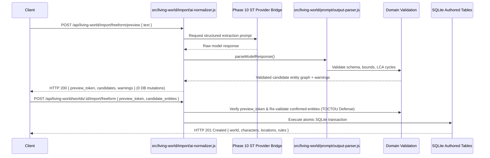

# Phase 11 Planning Artifact: Import, Normalization, and Authoring Workflow

## Status

**FROZEN / READY FOR AUTHORIZATION**

> [!IMPORTANT]
> **Implementation Authorization Gate:**
> Phase 11 implementation is **NOT** authorized by this planning task. Explicit user authorization of this completed and frozen planning document is required before implementation begins.

---

## 1. Planning Metadata, Git State, and Baseline Reconciliation

- **Target Subsystem:** Living World Simulator (LWS) Native Subsystem
- **Host Fork:** `DaviPiyu148/SillyTavern`, target branch `release`
- **Current Database Schema Version:** `PRAGMA user_version = 9` (Migration `009_environment_and_population.js` applied)
- **Phase 10 Status in Project State:** `IMPLEMENTED, VERIFIED, ACCEPTED` (Formally verified, accepted by user on 2026-09-26, and recorded in local [PROJECT_STATE.md](file:///D:/SillyTavern/docs/living-world/PROJECT_STATE.md#L60) and [AI_CHANGELOG.md](file:///D:/SillyTavern/docs/living-world/AI_CHANGELOG.md#L5)).
- **Phase 11 Status in Project State:** `DESIGNED` (Roadmap defined in [PHASE_DEVELOPMENT_PLAN.md](file:///D:/SillyTavern/docs/living-world/PHASE_DEVELOPMENT_PLAN.md#L286-L298); implementation not started).
- **Planning Artifact Revision:** Final Corrective Reconciliation & Specification Freeze.
- **Git State & Publication Lineage Reconciliation:**
  - **Remote Published Baseline:** Commit `63668f0a1bc6f4771eba343a07a94459835fe62a` on `origin/release`.
  - **Local Unpublished Commits on Branch `release`:**
    - `2173a757c36c01f6a9ecb05a1e03a4fe629fb247` — initial Phase 11 planning artifact (*LOCAL / UNPUBLISHED*);
    - `73e6e79a40232cb81733c187f6cb6e229c4f50a2` — architecture and schema audit update (*LOCAL / UNPUBLISHED*);
    - `2d6d9f5d96baae55a3110479d5218bc5a92cc41c` — finalized Phase 11 planning artifact for review (*LOCAL / UNPUBLISHED*);
    - `c2fba72293d72d97aa28a3c02c1871eda9d65b22` — frozen Phase 11 planning artifact across all 17 audit criteria (*LOCAL / UNPUBLISHED*);
    - `58359bd6ca7a60a11b7f8941c753245886018293` — final corrective freeze pass on planning specification (*LOCAL / UNPUBLISHED*);
    - `3d62e4403030379c38b3da56449cf6f3e4be27bc` — recorded final commit lineage in Phase 11 plan (*LOCAL / UNPUBLISHED*);
    - `82609ffc8bcb1ae68df72bd7a183a3a4a352a17e` — final corrective reconciliation on Phase 11 planning specification (*LOCAL / UNPUBLISHED*).
  - All Phase 11 planning revisions remain strictly local to the working branch until formally pushed following user authorization.

---

## 2. Phase Goal

Make existing SillyTavern and AI-RP content (Character Cards V1/V2/V3 in PNG/JSON, World Info / Lorebooks, Canonical LWS World Manifests, and Freeform text) fully usable in the Living World Simulator (LWS) by establishing a deterministic, provenance-preserving normalization pipeline, robust conflict detection and disambiguation, mandatory preview-to-commit token binding, an AI-assisted normalization option, and a comprehensive authored bundle workflow—while strictly preserving the architectural boundary that external and model-generated content is untrusted and never directly mutates runtime simulation state.

---

## 3. Scope Distinction: Original Roadmap vs. Implementation-Level Design Enhancements

To maintain complete architectural transparency and preserve historical provenance, Phase 11 distinguishes original roadmap requirements from implementation-level design enhancements:

### 3.1 Original Roadmap Scope (from `PHASE_DEVELOPMENT_PLAN.md`)
- **Character Card Import:** Parsing and normalizing SillyTavern character cards into authored characters.
- **World Info / Lorebook Import:** Parsing and classifying lorebook entries into authored world components.
- **Freeform World / Scenario Import:** Ingesting unstructured outlines and world descriptions.
- **AI-Assisted Normalization:** Leveraging model generation to propose structured authored entities from unstructured text.
- **Provenance Preservation:** Tracking original source, version, format, mappings, and unmapped fields.
- **Conflict Detection:** Detecting identity collisions against active authored records.
- **Review / Confirmation:** Providing dry-run previews with ambiguity flags before committing changes.
- **Authored World / Character Creation Workflow:** Establishing multi-entity authored creation and validation.

### 3.2 Implementation-Level Design Enhancements
- **Enhancement A — Canonical LWS World Manifest (`lws_world_manifest_v1`):** A formalized multi-entity JSON (with optional safe YAML) interchange specification enabling atomic, semantic/relationally lossless export and import of complete Worlds with hierarchical locations, factions, rules, scenarios, ambient archetypes, and prompt configs.
- **Enhancement B — Full V1/V2/V3 PNG Chunk Extraction:** Reusing SillyTavern host infrastructure to extract both `ccv3` and `chara` PNG `tEXt` chunks with precedence ordering.
- **Enhancement C — TOCTOU & Preview Token Binding:** Mandatory cryptographic preview token binding and transaction-level re-validation preventing race conditions and payload spoofing between advisory preview and final commit.
- **Enhancement D — Symmetric World Export Endpoint:** Providing `GET /api/living-world/worlds/:worldLwsId/export/manifest` as the symmetric pairing to manifest import for round-trip validation.

---

## 4. Non-Goals

- **UI / Frontend Implementation:** User interface screens, drawers, drag-and-drop file upload dialogs, and visual preview modals belong strictly to **Phase 12: Native SillyTavern User Workflow and UI**.
- **Runtime Simulation Mutation:** Importing a card or world NEVER instantiates a simulation or mutates `lws_simulations`, `lws_simulation_characters`, or `lws_events`.
- **Long-Run Regression Suites & Release Packaging:** Full-suite soak testing, disaster recovery, and release backup packaging belong strictly to **Phase 13: Replay, Hardening, Release Readiness, and Long-Run Verification**.
- **Automated Directory Sync:** LWS does not maintain an automated background file-watcher or live sync over SillyTavern's `data/default-user/characters/` folder; all imports are explicit, intentional user/API actions.
- **Optional Archive Formats:** BYAF (`.byaf`) multi-character packs and CharX (`.charx`) archive packages with embedded voice/sprite packs are explicitly deferred to future releases.
- **Core ST Refactoring:** Modifying SillyTavern's host card parsers (`src/character-card-parser.js`) or validator files (`src/validator/TavernCardValidator.js`) outside LWS boundaries.

---

## 5. Architectural Invariants

1. **$\mathbf{LLM / External\ Proposes \to Simulation\ Engine\ Decides \to Database\ Records\ Reality \to Narrative\ Presents\ Reality}$:** External content and AI-generated normalization outputs are untrusted proposals that must pass schema and domain validation before entering the database.
2. **Authored vs. Runtime Domain Separation (Domain Rules 5–7, ADR-006, Reconciled with Policy C):** Authored data and Runtime simulation state remain strictly separate persistence and mutation domains:
   - Import, normalization, and authoring operations write ONLY to authored tables (`lws_worlds`, `lws_characters`, `lws_locations`, `lws_factions`, `lws_world_rules`, `lws_scenarios`, `lws_authored_prompt_configs`, `lws_ambient_archetypes`). They **NEVER** write to runtime simulation tables (`lws_simulations`, `lws_simulation_characters`, `lws_events`, etc.).
   - Under **Policy C** (Section 9), active simulations intentionally read active authored environmental baselines (World Rules, Locations, Factions, Ambient Archetypes, Authored Prompt Configs) as the dynamic setting context during prompt assembly (Layer 3 `world_premise_rules`, Layer 4 `style_and_author_instructions`) and ambient population generation.
   - Simulation Core Characters are permanently guarded against authored mutation via immutable `authored_snapshot` JSON records inside `lws_simulation_characters`. The prompt context builder unpacks `sc.authored_snapshot` for Layer 5 character profile, ensuring live edits to `lws_characters` cannot perturb running character personalities.
   - Simulation replay (`simulationReducer`) remains 100% event-driven and zero-SQL, independent of live authored queries, guaranteeing replay determinism without drift.
3. **Provenance Preservation (Domain Rule 37, ADR-009):** Original source hashing (`source_file_hash`, `source_raw_body_hash`, or `canonical_object_hash`), format version, source filename, mapping decisions, dropped properties, and warnings are permanently preserved.
4. **Missing Data Invariant (Domain Rule 37):** Missing fields in source inputs remain missing (stored canonically as empty strings `''`, empty arrays `[]`, or `null` according to column schema). Normalization must never hallucinate or invent detail (e.g. absent `character_version` is never defaulted to `"1.0"`).
5. **Lore is Not Physical Reality (Domain Rule 10, IMPORT_AND_NORMALIZATION.md):** Arbitrary lorebook text, background descriptions, and flavor lore do not automatically become physical world constraints or authoritative world rules.
6. **Non-Omniscience & Security (Domain Rules 8–13, 37–39):** Untrusted input parsing must defend against prototype pollution, path traversal, regex DoS, oversized payloads, and circular location hierarchies.

---

## 6. Comprehensive Schema & Column Audit

### 6.1 Column-by-Column Table Audit

The repository database schema was inspected in `src/living-world/migrations/002_authored_model.js` and `src/living-world/migrations/009_environment_and_population.js`:

| Table Name | Entity Class | Schema Migration | Columns Present in Repository | Has `extensions` Column? |
|---|---|---|---|:---:|
| `lws_worlds` | Root Entity | 002 | `id`, `lws_id`, `name`, `description`, `tags`, `extensions`, `created_at`, `updated_at`, `deleted_at` | **YES** |
| `lws_characters` | Authored Entity | 002 | `id`, `lws_id`, `world_id`, `name`, `description`, `personality`, `scenario_context`, `mes_example`, `author_notes`, `system_prompt_override`, `source_version`, `tags`, `extensions`, `created_at`, `updated_at`, `deleted_at` | **YES** |
| `lws_locations` | Authored Entity | 002 | `id`, `lws_id`, `world_id`, `parent_location_id`, `name`, `description`, `tags`, `extensions`, `created_at`, `updated_at`, `deleted_at` | **YES** |
| `lws_factions` | Authored Entity | 002 | `id`, `lws_id`, `world_id`, `name`, `description`, `tags`, `extensions`, `created_at`, `updated_at`, `deleted_at` | **YES** |
| `lws_scenarios` | Authored Entity | 002 | `id`, `lws_id`, `world_id`, `name`, `description`, `starting_location_id`, `tags`, `extensions`, `created_at`, `updated_at`, `deleted_at` | **YES** |
| `lws_authored_prompt_configs` | Authored Config (1:1 with World) | 002 | `id`, `lws_id`, `world_id`, `style_notes`, `tone_notes`, `format_notes`, `extensions`, `created_at`, `updated_at` | **YES** |
| `lws_world_rules` | Authored Rule | 002 | `id`, `lws_id`, `world_id`, `sort_order`, `title`, `body`, `created_at`, `updated_at`, `deleted_at` | **NO** |
| `lws_character_factions` | Join Table | 002 | `character_id`, `faction_id`, `role` | **NO** |
| `lws_scenario_characters` | Join Table | 002 | `scenario_id`, `character_id`, `role` | **NO** |
| `lws_ambient_archetypes` | Authored Archetype | 009 | `id`, `lws_id`, `world_id`, `archetype_key`, `entity_kind`, `role_title`, `name_pool`, `description_template`, `default_activities`, `location_tags`, `time_windows`, `weather_compat`, `spawn_weight`, `max_concurrent_instances`, `created_at`, `updated_at`, `deleted_at` | **NO** |

### 6.2 Stable Provenance Keys Architecture

To guarantee complete, lossless provenance without database schema changes:
1. **Primary Authored Tables with `extensions` Column (6 Tables):**
   - `lws_worlds`, `lws_characters`, `lws_locations`, `lws_factions`, `lws_scenarios`, and `lws_authored_prompt_configs` persist provenance directly in their respective `extensions.provenance` JSON object.
2. **Authored Tables & Join Tables without `extensions` Column (4 Tables):**
   - **`lws_world_rules`:** Keyed by public UUID `rule.lws_id` inside `lws_worlds.extensions.provenance.imported_components.world_rules[rule.lws_id]`.
   - **`lws_ambient_archetypes`:** Keyed by public UUID `archetype.lws_id` inside `lws_worlds.extensions.provenance.imported_components.ambient_archetypes[archetype.lws_id]`.
   - **`lws_character_factions` (Join Table):** Because join tables have no `lws_id`, provenance is keyed by stable composite public key `"${character_lws_id}:${faction_lws_id}"` inside `lws_worlds.extensions.provenance.imported_components.character_factions["${character_lws_id}:${faction_lws_id}"] = { role, source_entry, imported_at }`.
   - **`lws_scenario_characters` (Join Table):** Keyed by stable composite public key `"${scenario_lws_id}:${character_lws_id}"` inside `lws_worlds.extensions.provenance.imported_components.scenario_characters["${scenario_lws_id}:${character_lws_id}"] = { role, source_entry, imported_at }`.
3. **Relationship Mutation & Re-Import Provenance:**
   - **Creation:** Added to `imported_components` with creation timestamp and source reference.
   - **Deletion / Removal:** Recorded in `lws_worlds.extensions.provenance.relationship_mutations: [{ type: 'character_faction_removed', character_lws_id, faction_lws_id, timestamp }]`.
   - **Replacement / Re-import:** If relationship exists with identical role, logged as idempotent re-import; if role changed, updated and logged in mutation history.
4. **Zero-Schema-Change Proof:** `PRAGMA user_version = 9` is strictly preserved with zero migrations.

---

## 7. Conflict Model: Disambiguating Identity, Semantic, and Normalization Ambiguities

Phase 11 strictly separates three orthogonal classes of conflicts to prevent silent state manipulation:

```mermaid
flowchart TD
    Input[Incoming Import Proposal] --> Check{Conflict Category}
    
    Check -- 1. Identity Collision --> Ident[Active Name / Key Collision]
    Ident --> Policy{User Policy}
    Policy -- REJECT --> Err409[HTTP 409 Conflict]
    Policy -- RENAME --> AutoName[Suffix Name (Import 2)]
    Policy -- REPLACE --> SoftDel[Soft-Delete Old + Insert New]
    Policy -- MERGE --> FieldMerge[Non-Destructive Explicit Field Merge]
    
    Check -- 2. Semantic Conflict --> Sem[Contradictory World Facts]
    Sem --> FlagSem[Log Both Claims in Provenance / Flag for User Preview]
    
    Check -- 3. Normalization Ambiguity --> Amb[Multiple Valid Entity Classes]
    Amb --> FlagAmb[Mark Candidate Ambiguous in Preview / Await User Selection]
```

### 7.1 Formal Conflict Object Schema & Canonical ID Derivation
Every detected conflict produces a standardized conflict object:
```json
{
  "conflict_id": "sha256(world_lws_id + ':' + conflict_type + ':' + candidate_id + ':' + target_identifier)",
  "candidate_id": "uuid-v4-string",
  "conflict_type": "IDENTITY_COLLISION_ACTIVE_NAME | IDENTITY_COLLISION_KEY | IDENTITY_COLLISION_UUID | IDENTITY_COLLISION_RELATIONSHIP | SEMANTIC_CONTRADICTION_FACT | SEMANTIC_CONTRADICTION_TOPOLOGY | CLASSIFICATION_AMBIGUITY | UNRESOLVED_FOREIGN_KEY",
  "source_ref": {
    "file": "string",
    "entry_index": 0,
    "entry_key": "string",
    "chunk_name": "string"
  },
  "severity": "info | warning | blocking_error",
  "blocking": true,
  "colliding_entity": {
    "id": 12,
    "lws_id": "uuid-v4-string",
    "name": "string",
    "type": "world | character | location | faction | scenario | rule | archetype | relationship",
    "updated_at": "ISO-8601"
  },
  "available_resolutions": ["REJECT", "RENAME", "REPLACE", "MERGE", "KEEP_BOTH_AS_LORE", "DISCARD_CANDIDATE"],
  "resolution_provenance": null
}
```

#### Canonical `target_identifier` Hashing Values:
- **`IDENTITY_COLLISION_ACTIVE_NAME`:** `target_identifier` is `"${world_lws_id}:name:${entity_type}:${normalized_name}"`.
- **`IDENTITY_COLLISION_KEY`:** `target_identifier` is `"${world_lws_id}:key:${archetype_key}"`.
- **`IDENTITY_COLLISION_UUID`:** `target_identifier` is `"${target_entity_lws_id}"`.
- **`IDENTITY_COLLISION_RELATIONSHIP`:** `target_identifier` is `"${parent_lws_id}:${child_lws_id}"`.
- **`SEMANTIC_CONTRADICTION_FACT`:** `target_identifier` is `"${world_lws_id}:fact:${field_name}"`.
- **`SEMANTIC_CONTRADICTION_TOPOLOGY`:** `target_identifier` is `"${world_lws_id}:topology:${location_lws_id}"`.
- **`CLASSIFICATION_AMBIGUITY`:** `target_identifier` is `"${entry_uid}"`.
- **`UNRESOLVED_FOREIGN_KEY`:** `target_identifier` is `"${foreign_lws_id}"`.

#### Blocking Semantics:
- `severity: 'blocking_error'` $\implies$ `blocking = true` (commit blocked until resolved).
- `severity: 'warning'` $\implies$ `blocking = false` (commit proceeds with default non-destructive resolution).
- `severity: 'info'` $\implies$ `blocking = false` (informational note).

### 7.2 Conflict Categories & Behaviors
1. **Category 1: Identity / Name Collisions:**
   - Occurs when an incoming entity matches the identity key of an existing active record in the target World:
     - `(world_id, LOWER(name))` where `deleted_at IS NULL` for Worlds, Characters, Locations, Factions, Scenarios;
     - `(world_id, archetype_key)` where `deleted_at IS NULL` for Ambient Archetypes;
     - `lws_id` for UUID-matched updates;
     - `(character_id, faction_id)` / `(scenario_id, character_id)` for join tables.
   - **`REJECT` (Default Fail-Safe):** Returns HTTP 409 Conflict with colliding entity details. 0 DB changes.
   - **`RENAME`:** Appends incremental disambiguation suffix: `Name (Import 2)`. Inserts new row with fresh UUID.
   - **`REPLACE`:** Soft-deletes existing active record (`deleted_at = isoNow()`). Inserts new record with fresh UUID.
   - **`MERGE`:** Non-destructive explicit field merge (detailed in Section 8).
2. **Category 2: Semantic Conflicts:**
   - Occurs when imported source text contains contradictory factual claims (e.g. Source A: *"The citadel fell in 1042"*, Source B: *"The citadel was never breached"*).
   - **Rule:** The normalizer NEVER silently chooses between contradictory factual claims. `RENAME`, `REPLACE`, and `MERGE` policies do NOT resolve semantic contradictions.
   - **Behavior:** Both claims are preserved as distinct candidate lore entries or flagged in preview under `semantic_conflicts: [{ field, claim_a, claim_b, source_a, source_b }]` for explicit user arbitration.
3. **Category 3: Normalization / Classification Ambiguity:**
   - Occurs when source text could map to multiple valid entity classes (e.g. a lorebook entry describing *"The City Watch"* which could be a Faction, an Ambient Archetype, or a World Rule).
   - **Rule:** The normalizer NEVER silently assigns ambiguous entries to authoritative state.
   - **Behavior:** The candidate is returned in preview with `ambiguity_flags: [{ entry_uid, candidate_types: ['faction', 'ambient_archetype', 'world_rule'], confidence }]` requiring user selection before persistence.

### 7.3 World-Root & UUID Collision Semantics
- **World-Root Collisions:**
  - `lws_worlds` has unique active name index `idx_lws_worlds_name_active`.
  - If importing a World whose name collides with an active World:
    - `REJECT`: Fails with HTTP 409 Conflict.
    - `RENAME`: Suffixes name (`World Name (Import 2)`).
    - `REPLACE`: Soft-deletes existing world (`deleted_at = isoNow()`).
    - `MERGE`: Updates world `description` (if non-empty), merges `tags` (set union), and deep merges `extensions`. Existing child entities remain intact; child entities in import payload are merged per their respective child policies.
- **UUID Collisions against Active vs. Soft-Deleted Records:**
  - **Active Record (`deleted_at IS NULL`):** Collision handled by selected policy (`REJECT`, `REPLACE`, `MERGE`).
  - **Soft-Deleted Record (`deleted_at IS NOT NULL`):** An incoming entity cannot insert with the same UUID due to SQLite `lws_id UNIQUE` constraint. If a collision occurs against a soft-deleted row, the importer automatically generates a fresh UUID (`generateUuid()`), maps it in `id_map`, and logs the remapping in `extensions.provenance`.

---

## 8. Non-Destructive Explicit Field Merge Semantics

The merge policy is an **explicit, field-by-field merge** defined as follows:

| Authored Entity | Field | Merge Behavior |
|---|---|---|
| **`lws_worlds`** | `name` | Preserved from existing record. |
| | `description` | Updated if imported string is non-empty. |
| | `tags` | Set union of tags: `Array.from(new Set([...existingTags, ...importedTags]))`. |
| | `extensions` | Deep object merge (prototype pollution stripped); existing keys preserved. |
| **`lws_characters`** | `name` | Preserved from existing record (never altered). |
| | `description`, `personality`, `scenario_context`, `mes_example`, `author_notes`, `system_prompt_override` | Non-empty imported string updates existing field; empty imported string preserves existing field. |
| | `source_version` | Updated to imported version if non-empty; preserved if omitted. |
| | `tags` | Set union: `Array.from(new Set([...existingTags, ...importedTags]))`. |
| | `extensions` | Deep object merge (prototype pollution stripped); existing keys preserved, overlapping keys updated. |
| | `extensions.provenance` | Existing provenance preserved; new merge event appended to `provenance.import_history: []`. |
| **`lws_locations`** | `name` | Preserved from existing. |
| | `description` | Updated if imported string is non-empty. |
| | `parent_location_id` | Updated ONLY if explicitly specified in imported payload AND validated acyclic; omitted/null leaves existing intact. |
| | `tags`, `extensions` | Set union of tags; deep merge of extensions. |
| **`lws_factions`** | `name` | Preserved from existing. |
| | `description` | Updated if imported non-empty. |
| | `tags`, `extensions` | Set union of tags; deep merge of extensions. |
| **`lws_scenarios`** | `name` | Preserved from existing. |
| | `description` | Updated if imported non-empty. |
| | `starting_location_id` | Updated if explicitly specified; otherwise preserved. |
| | `tags`, `extensions` | Set union of tags; deep merge of extensions. |
| **`lws_world_rules`** | `title`, `body` | Matched by `lws_id` or `(world_id, LOWER(title))`. Updated if non-empty; `sort_order` preserved unless explicitly reordered. |
| **`lws_authored_prompt_configs`** | `style_notes`, `tone_notes`, `format_notes` | Overwritten if non-empty; extensions deep merged. Resetting config sets notes to `''` (no `deleted_at` column). |
| **`lws_ambient_archetypes`** | `role_title`, `description_template` | Matched by `archetype_key`. Updated if non-empty; `name_pool`, `default_activities`, `location_tags`, `time_windows` merged as set unions. |
| **Join Tables** (`lws_character_factions`, `lws_scenario_characters`) | `role` | Matched by composite key. `role` updated if non-empty in import. |

### 8.1 Disagreeing Identity Signals & UUID Remapping
- **Signal Disagreement:** If an imported payload specifies `lws_id` matching Entity A, but `name` matches active Entity B:
  - `lws_id` is the primary immutable identity signal for the merge target.
  - Because Entity B already holds the target name in SQLite (`idx_..._name_active`), the merge cannot rename Entity A to Entity B's name without violating uniqueness; the orchestrator emits a `blocking_error` (`IDENTITY_COLLISION_NAME_IN_USE`).
- **Source-to-Target UUID Mapping (`id_map`):**
  - When merging or remapping entities, the orchestrator maintains an `id_map: { [source_uuid]: target_uuid }`.
  - Foreign key references across the imported graph (e.g. `parent_location_id`, `starting_location_id`, `faction_id`, `character_id`) are rewritten using `id_map` prior to insertion.
- **Idempotent Re-Import:**
  - Re-importing the exact same manifest or card with `MERGE` results in 0 field changes and appends an idempotent sync record to `extensions.provenance.import_history`.
- **Immutable Provenance History:**
  - Merges preserve existing `provenance.created_from` and append `{ action: 'merge', merged_at: isoNow(), source_hash, updated_fields: [...] }` to `provenance.import_history`.

---

## 9. Active Simulation Safety: Authoritative Policy & Entity Reference Matrix

### 9.1 Authoritative Simulation Baseline Policy
**Policy C: Explicitly Defined Live-Authored Dynamic Baseline with Snapshot-Guarded Core Characters and Soft-Delete Referential Integrity.**

1. **Core Characters:** Guarded by an immutable `authored_snapshot` JSON string frozen at scenario instantiation inside `lws_simulation_characters` (ADR-011). In-flight character cognition, needs, values, and memories evolve causally via events; soft-deleting or replacing the authored character template row does not perturb active simulations. The prompt context builder unpacks `sc.authored_snapshot` for Layer 5 character profile, ensuring live edits to `lws_characters` cannot perturb running character personalities.
2. **Live Environmental Baselines:** World Rules, Locations, Factions, Ambient Archetypes, and Authored Prompt Configs represent the authored environment baseline of the World. Active simulations query active records (`deleted_at IS NULL`) dynamically during Prompt Context construction (Layer 3 `world_premise_rules`, Layer 4 `style_and_author_instructions`) and ambient population generation.
3. **Soft-Delete Referential Integrity:** Authored entities are never physically deleted (`DELETE FROM ...`); they are soft-deleted via `deleted_at = isoNow()`. SQLite integer primary keys and foreign keys (`sc.current_location_id`, `sc.character_id`, `lws_events.location_id`) remain permanently valid. Active characters remain at their location; new movements to soft-deleted locations are blocked by domain validation.
4. **Authored Prompt Config Reset Semantics:** `lws_authored_prompt_configs` has no `deleted_at` column. Deleting or resetting prompt config resets notes to `''` (`style_notes = ''`, `tone_notes = ''`, `format_notes = ''`, `extensions = '{}'`), causing active simulations to fall back to default prompts when notes are empty.
5. **Replay Invariance:** Simulation replay (`simulationReducer` in `src/living-world/events/replay.js`) is purely event-driven and zero-SQL. Replay reconstructs runtime state strictly from the recorded `lws_events` log and initial character snapshots, with zero reliance on live authored database queries. Thus, mutating authored tables never causes replay drift.

### 9.2 Entity-by-Entity Reference Matrix

| Entity Type | Reference Mechanism in Active Simulation | Behavior on Soft-Delete | Behavior on Replace | Behavior on Rename | Behavior on Merge |
|---|---|---|---|---|---|
| **Character** (`lws_characters`) | Referenced by `lws_simulation_characters.character_id` (integer FK). Frozen copy stored in `lws_simulation_characters.authored_snapshot`. | Simulation continues reading frozen snapshot and historical integer row ID. Trigger `trg_lws_sim_chars_authored_snapshot_immutable` prevents snapshot mutation. | Replaced row soft-deleted; historical integer FK remains valid in SQLite. In-flight simulation unaffected. New simulations see fresh row. | Simulation character reads frozen snapshot; runtime behavior unchanged. | Simulation character retains frozen instantiation snapshot. If runtime requires authored refresh, explicit director command required. |
| **World** (`lws_worlds`) | Referenced by `lws_simulations.world_id` (integer FK). Trigger `trg_lws_simulations_world_id_immutable` prevents FK change. | Soft-deleted world returns 404 on parent endpoints; active child simulation rows remain physically intact in DB. | Old world soft-deleted; running simulation bound to historical world ID remains valid. | Simulation references integer FK; world display name updates for observer perspective if queried live. | Settings/extensions merged; running simulations unaffected. |
| **Location** (`lws_locations`) | Referenced by `lws_simulation_characters.current_location_id` and `lws_events.location_id`. | Triggers `trg_lws_sim_chars_location_update` and `trg_lws_events_same_world_location` allow existing assignments to persist but block *new* movements to soft-deleted locations. | Existing character locations preserved; new pathfinding routes exclude soft-deleted location. | Live observer location name updates; character coordinates/topology intact. | Operational state/description updated; ongoing simulations inherit updated environment baseline if re-evaluated. |
| **Faction** (`lws_factions`) | Referenced by `lws_character_faction_memberships.faction_id`. | Runtime memberships (`lws_character_faction_memberships`) hold snapshots of faction name/standing; soft-deletion of authored faction does not drop runtime rows. | Old faction soft-deleted; runtime faction state preserved. | Runtime memberships update display name if queried live. | Authored faction description updated; runtime standings intact. |
| **Scenario** (`lws_scenarios`) | Referenced by `lws_simulations.scenario_id` (optional integer FK). Trigger `trg_lws_simulations_scenario_id_immutable` prevents FK mutation. | Simulation runs independently; scenario was merely the initial configuration template. | Old scenario soft-deleted; running simulation unaffected. | Simulation unaffected. | Starting conditions updated for future simulations; active simulation unaffected. |
| **World Rule** (`lws_world_rules`) | Injected into Prompt Context Layer 3 (`world_premise_rules`) via live query (`WHERE deleted_at IS NULL`). | Next LLM generation turn prompt omits the deleted rule; deterministic simulation logic unaffected unless rule was referenced in cognition deliberation. | Next turn prompt receives updated rule text. | Prompt reflects updated rule title. | Prompt reflects merged rule body. |
| **Ambient Archetype** (`lws_ambient_archetypes`) | Queried dynamically during ambient population generation (`generateAmbientPopulation`). | Soft-deleted archetypes are excluded from future viewport ambient spawns (`WHERE deleted_at IS NULL`). Already promoted characters hold immutable promotion records (`lws_promoted_entity_records`). | New spawns use replacement archetype; promoted characters unaffected. | New spawns use renamed archetype. | Updated activity/name pool immediately available for next viewport spawn. |
| **Authored Prompt Config** (`lws_authored_prompt_configs`) | Injected into Prompt Context Layer 4 (`style_and_author_instructions`) via live query. | If reset, notes are set to `''`; simulation falls back to defaults. (No `deleted_at` column). | Next turn prompt receives updated style/tone notes. | N/A (single row per world). | Style/tone notes updated; running simulation reflects updated prompt instructions on next generation turn. |
| **Join Tables** (`lws_character_factions`, `lws_scenario_characters`) | Used only during scenario instantiation to seed initial memberships/roster. | Soft-deleted / removed relationships do not alter active runtime simulation memberships or active character instances. | New simulations use updated roster; active simulations unaffected. | N/A. | Updated roles apply to future simulation instantiations. |

---

## 10. Canonical LWS World Manifest Specification (`lws_world_manifest_v1`)

### 10.1 Classification, Interchange Format, and YAML Safety
- **Classification:** Implementation-Level Design Enhancement.
- **Interchange Format Standard:**
  - **Canonical Standard:** JSON (`application/json`) is the primary, required interchange format.
  - **Optional YAML Support:** Handled via router-local middleware and parsed using the repository's `yaml` dependency (`yaml` v2.8.3, minimum supported `^2.0.0`):
    - Router-local text parser: `express.text({ type: ['application/x-yaml', 'text/yaml', 'text/plain'], limit: '10mb' })` mounted on manifest import routes in `src/endpoints/living-world.js`.
    - Strict parser options: `yaml.parse(text, { customTags: [], maxAliasCount: 100, merge: true })`.
    - Security: Custom code tags prohibited; prototype-pollution filtered (`__proto__`, `constructor`, `prototype` stripped); max alias count limited to 100 and max depth 10 to prevent YAML bomb/Billion Laughs denial of service; payload limit 10 MB.
    - Malformed YAML syntax returns HTTP 400 (`code: 'LWS_UNSUPPORTED_FORMAT'`).
- **Original Roadmap Basis:** Fulfills `PHASE_DEVELOPMENT_PLAN.md` Phase 11 requirement for "authored world/character creation workflow" and "canonical LWS entities are valid and reusable."

### 10.2 Public UUID Preservation vs. Remapping
- **Preservation:** When importing into a fresh world (or `preserve_ids: true` and no UUID collisions exist in SQLite), original `lws_id` values are preserved.
- **Deterministic Remapping:** When importing with `preserve_ids: false` or on UUID collision with `RENAME`, fresh UUIDs (`generateUuid()`) are assigned, and all internal relational links are remapped using `id_map`.

### 10.3 Canonical Parity Comparison Algorithm
When verifying export/import round-trip fidelity, the parity contract defines exact matching vs. intentionally differing values:

1. **Intentionally Differing Values:**
   - SQLite internal integer primary keys (`id`, `world_id`, `character_id`, `location_id`, `faction_id`, `scenario_id`) are newly allocated by SQLite AUTOINCREMENT and excluded from parity comparison.
   - `created_at`, `updated_at` reflect the import execution timestamp.
   - `extensions.provenance` records the import event and source manifest hash.
2. **Strict Parity Comparison Steps (Relational Topology via Public UUIDs):**
   - **Step 1:** Strip internal integer primary keys (`id`, integer FKs).
   - **Step 2:** Normalize Unicode NFC across all strings.
   - **Step 3:** Compare scalar text attributes (`name`, `description`, `personality`, `scenario_context`, `mes_example`, `author_notes`, `system_prompt_override`, `body`, `style_notes`, `tone_notes`, `format_notes`) using strict string equality `===`.
   - **Step 4:** Compare unordered collections using sorted set equality (`lodash.isEqual(a.slice().sort(), b.slice().sort())`):
     - `tags`, `name_pool`, `default_activities`, `location_tags`, `time_windows`;
     - `lws_scenario_characters` roster (compared as an unordered relational set of `(character_lws_id, role)` pairs, as `lws_scenario_characters` has no `sort_order` column).
   - **Step 5:** Compare ordered collections (`lws_world_rules` sorted by `sort_order ASC`) preserving exact sequence index.
   - **Step 6:** Compare extension objects via deep equality excluding transient runtime sync metadata.
   - **Step 7:** Verify 100% relational graph topology using public UUIDs (`lws_id`):
     - Location hierarchy parent-child links match 100% via `parent_location_lws_id`.
     - Character-to-faction memberships and roles match 100% via `(character_lws_id, faction_lws_id, role)`.
     - Scenario starting location references match 100% via `starting_location_lws_id`.
   - **Step 8:** Soft-deleted records (`deleted_at IS NOT NULL`) are omitted from exported manifest.

---

## 11. Comprehensive Character Card Compatibility Specification

### 11.1 Complete Field Mapping Table

| Source Field | V1 Spec | V2 Spec (`data.*`) | V3 Spec (`data.*`) | Destination in LWS | Normalization & Type | Preservation Behavior | Warning / Discard Behavior | Round-Trip Status |
|---|:---:|:---:|:---:|---|---|---|---|:---:|
| `name` | Flat root | `data.name` | `data.name` | `lws_characters.name` | String, NFC trimmed (Max 255 chars) | Stored in column | Rejects with 400 if missing or empty | Verbatim |
| `description` | Flat root | `data.description` | `data.description` | `lws_characters.description` | String, NFC (Max 65,535 chars) | Stored in column | Defaults to `''` if omitted | Verbatim |
| `personality` | Flat root | `data.personality` | `data.personality` | `lws_characters.personality` | String, NFC (Max 65,535 chars) | Stored in column | Defaults to `''` if omitted | Verbatim |
| `scenario` | Flat root | `data.scenario` | `data.scenario` | `lws_characters.scenario_context` | String, NFC (Max 65,535 chars) | Stored in column | Renamed to `scenario_context` | Normalized |
| `first_mes` | Flat root | `data.first_mes` | `data.first_mes` | `extensions.first_mes` | String, NFC | Preserved in `extensions` | Defaults to `''` | Verbatim |
| `mes_example` | Flat root | `data.mes_example` | `data.mes_example` | `lws_characters.mes_example` | String, NFC (Max 65,535 chars) | Stored in column | Defaults to `''` if omitted | Verbatim |
| `alternate_greetings` | N/A | `data.alternate_greetings` | `data.alternate_greetings` | `extensions.alternate_greetings` | Array of strings | Preserved in `extensions` | Defaults to `[]` | Semantic |
| `post_history_instructions` | N/A | `data.post_history_instructions` | `data.post_history_instructions` | `extensions.post_history_instructions` | String, NFC | Preserved in `extensions` | Defaults to `''` | Verbatim |
| `creator` | N/A | `data.creator` | `data.creator` | `extensions.creator` | String, NFC | Preserved in `extensions` | Defaults to `''` | Verbatim |
| `character_version` | N/A | `data.character_version` | `data.character_version` | `lws_characters.source_version` | String (Max 50 chars) | Stored in column | Preserved if present; stored as `''` / `null` if omitted (never defaulted to `"1.0"`) | Verbatim |
| `creator_notes` | N/A | `data.creator_notes` | `data.creator_notes` | `lws_characters.author_notes` | String, NFC | Stored in `author_notes` | Defaults to `''` | Verbatim |
| `system_prompt` | N/A | `data.system_prompt` | `data.system_prompt` | `lws_characters.system_prompt_override`| String, NFC | Stored in column | Defaults to `''` | Verbatim |
| `tags` | N/A | `data.tags` | `data.tags` | `lws_characters.tags` | Array of strings (JSON string in DB) | Stored in column | Defaults to `[]` | Semantic |
| `nickname` | N/A | N/A | `data.nickname` | `extensions.nickname` | String, NFC | Preserved in `extensions` | Defaults to `''` | Verbatim |
| `character_book` | N/A | `data.character_book` | `data.character_book` | Embedded Lorebook Pipeline | Object with `entries: []` | Extracted into candidates (Section 12) | Unconverted lore preserved in `extensions.lorebook` | Normalized |
| `assets` | N/A | N/A | `data.assets` | `extensions.assets` | Array / Object | Preserved in `extensions` | Emits info warning `ASSETS_PRESERVED_IN_EXTENSIONS` | Semantic |
| `creator_notes_multilingual` | N/A | N/A | `data.creator_notes_multilingual` | `extensions.creator_notes_multilingual` | Object map | Preserved in `extensions` | Defaults to `{}` | Semantic |
| `source` / `sources` | N/A | N/A | `data.sources` | `extensions.sources` | Array of strings / string | Preserved in `extensions` | Defaults to `[]` | Semantic |
| `group_only_greetings` | N/A | N/A | `data.group_only_greetings` | `extensions.group_only_greetings` | Array of strings | Preserved in `extensions` | Defaults to `[]` | Semantic |
| `creation_date` / `modification_date` | N/A | `data.creation_date` | `data.creation_date` | `extensions.provenance.source_creation_date` | String / Number | Preserved in `extensions.provenance` | Preserved as metadata | Metadata |
| `extensions` | N/A | `data.extensions` | `data.extensions` | `lws_characters.extensions` | Object (JSON string in DB) | Deep merged into `extensions` | Vendor keys preserved | Semantic |
| Unmapped / Vendor Fields | N/A | Extra keys in `data` | Extra keys in `data` | `extensions.unmapped_fields` | Object map | Stored in `extensions.unmapped_fields` | Emits warning `UNMAPPED_FIELDS_PRESERVED` | Semantic |

### 11.2 PNG Metadata Extraction & Precedence
1. **Extraction Order & Precedence:**
   - Buffer is inspected for PNG signature (`89 50 4E 47 0D 0A 1A 0A`).
   - PNG `tEXt` chunks are parsed via SillyTavern host infrastructure (`src/character-card-parser.js`).
   - **Precedence:** `ccv3` chunk (Spec V3) is checked first. If present and valid UTF-8 base64 JSON, it is parsed as Spec V3.
   - If `ccv3` is absent, the `chara` chunk (Spec V2/V1) is checked, base64 decoded, and parsed as JSON.
   - If both `ccv3` and `chara` exist, `ccv3` takes precedence; `extracted_payload_hash` records the SHA-256 of the parsed `ccv3` payload, and `secondary_chunk_hash` records the SHA-256 of the `chara` chunk.
2. **Card Format Classification & Forward Compatibility:**
   - **Malformed Cards:** Invalid JSON, corrupt PNG headers, missing required fields (`name`) $\implies$ returns HTTP 400 (`LWS_INVALID_CARD_FORMAT` / `LWS_VALIDATION_ERROR`).
   - **Unknown / Unrecognized Specs:** JSON missing standard ST `spec` identifiers $\implies$ heuristics extract known standard fields (`name`, `description`), unknown fields captured in `extensions.unmapped_fields.raw_source`, structured warning emitted `UNKNOWN_SPEC_FORMAT`.
   - **Valid Future Spec Versions (`spec_version > 3.0` or `chara_card_v4`):** Recognized future spec $\implies$ ingests known baseline fields, captures full unrecognized payload in `extensions.unmapped_fields`, structured warning emitted `FORWARD_COMPATIBLE_SPEC_VERSION`.

### 11.3 Source Hashing Definitions
- `source_file_hash`: SHA-256 hex digest of raw uploaded file buffer on disk (PNG file or JSON/YAML file).
- `source_raw_body_hash`: SHA-256 hex digest of raw HTTP request body bytes (when raw body transport is available).
- `canonical_object_hash`: Deterministic SHA-256 hex digest of JSON payload canonicalized via deterministic key sorting (`JSON.stringify(sortKeys(obj))`).
- `extracted_payload_hash`: SHA-256 hex digest of decoded JSON string extracted from a PNG text chunk (`ccv3` or `chara`).
- `secondary_chunk_hash`: SHA-256 hex digest of alternate PNG chunk if multiple metadata chunks were present.

---

## 12. Lorebook Extraction & Classification Pipeline

Enforcing the foundational domain invariant: **“Lore is not physical reality.”** Arbitrary lorebook text is never automatically transformed into authoritative `lws_world_rules` or `lws_factions` without deterministic classification or explicit user confirmation.

### 12.1 Deterministic Evidence & Scoring Model
Each lorebook entry is evaluated across 5 structural category evidence scores ($0.0 \le S_i \le 1.0$):

1. **Rule Score ($S_{\text{rule}}$):**
   - Keywords matching physical/magical/social absolutes: `["always", "cannot", "must", "law of", "physics", "system rule", "forbidden", "mechanic", "stat"]` (Weight: 0.35).
   - Entry marked `constant: true` or `selective: false` with system keys (Weight: 0.35).
   - Structured prescriptive syntax (e.g. `Condition -> Effect` or numbered laws) (Weight: 0.30).
2. **Location Score ($S_{\text{loc}}$):**
   - Keywords matching physical geography/structures: `["room", "city", "tavern", "castle", "forest", "district", "located at", "north of", "south of", "building", "street"]` (Weight: 0.40).
   - Spatial containment or hierarchy keys (Weight: 0.30).
   - Descriptive spatial tags (Weight: 0.30).
3. **Faction Score ($S_{\text{fac}}$):**
   - Keywords matching organized groups: `["guild", "order", "army", "clan", "syndicate", "alliance", "kingdom", "cult", "faction", "members"]` (Weight: 0.40).
   - Organizational hierarchy terms (`"leader"`, `"rank"`, `"headquarters"`) (Weight: 0.30).
   - Group membership rosters (Weight: 0.30).
4. **Ambient Archetype Score ($S_{\text{arch}}$):**
   - Keywords matching generic populations: `["guards", "patrons", "merchants", "villagers", "bandits", "citizens", "crowd", "nameless", "ambient"]` (Weight: 0.40).
   - Spawn activity patterns or time window references (Weight: 0.30).
   - Plural generic role titles (Weight: 0.30).
5. **Character Score ($S_{\text{char}}$):**
   - Singular proper noun identity, personal pronouns (`"he"`, `"she"`, `"they"`), personal history (Weight: 0.50).
   - Single-character personality traits and dialogue samples (Weight: 0.50).

### 12.2 Promotion Thresholds, Ambiguity, and Fallback Rules
- **High-Confidence Candidate Promotion:**
  - An entry is proposed as a specific structural candidate entity if and only if:
    $$\max_{i \in \{\text{rule}, \text{loc}, \text{fac}, \text{arch}, \text{char}\}}(S_i) \ge 0.80 \quad \text{AND} \quad \left(\max(S_i) - \text{second\_highest}(S_i)\right) \ge 0.20$$
- **Ambiguous Classification:**
  - If $\max(S_i) \ge 0.50$ but margin between the top two structural categories is $< 0.20$, the entry is marked `status: 'ambiguous'` and placed in preview with `ambiguity_flags: [{ entry_uid, candidate_types: [...], scores: {...} }]`.
- **Default Lore / Flavor Fallback Destination:**
  - If $\max(S_i) < 0.50$ (no structural signals match) or the entry represents narrative background/mythology, the entry falls back to `lore_entry`.
  - Lore entries are mapped to `candidate_entities.lore_entries` and persisted in `lws_worlds.extensions.lorebook` (or prompt config notes). They are **NEVER** automatically converted into `lws_world_rules`.

---

## 13. AI Normalization Authority Boundary



### 13.1 AI Normalization Invariants & Negative Tests
1. **Untrusted Proposal Model:** AI normalization produces untrusted candidate JSON graphs that are strictly quarantined until passing schema, bounds, and tree LCA cycle checks.
2. **Negative No-Invention Contract:**
   - Normalization prompts explicitly instruct the model: *"Extract only facts explicitly stated in the source text. Do not invent unmentioned locations, factions, or rules."*
   - Verification suites include negative tests: unstated properties must evaluate to empty strings/arrays; ungrounded hallucinations result in test failure.

---

## 14. Mandatory Preview Token Binding & TOCTOU Transaction-Time Re-Validation

1. **Advisory Preview & Mandatory Token Generation:**
   - Preview endpoints (`POST /api/living-world/import/*/preview`) are 100% read-only and dry-run. Zero SQLite mutations occur during preview.
   - Preview responses return a mandatory `preview_token` (HMAC-SHA256) binding:
     - `target_world_lws_id` (or `null` for new world creation);
     - `candidate_hash` (SHA-256 digest of normalized candidate graph);
     - `preview_state_hash` (hash of active entity names in target world at preview time);
     - `conflict_policy` (advisory default policy);
     - `expires_at` (15-minute TTL).
2. **Mandatory Token Verification on Commit:**
   - Every commit endpoint requires the `preview_token` in the request body.
   - The server verifies:
     - Token signature is valid;
     - Token has not expired (`Date.now() < expires_at`);
     - Submitted `candidate_entities` digest matches `candidate_hash`;
     - Target world matches `target_world_lws_id`.
   - Mismatched tokens or payloads reject immediately with `400 Bad Request` (`code: 'LWS_PREVIEW_TOKEN_MISMATCH'`).
3. **Commit-Time Transactional Re-Validation (TOCTOU Defense):**
   - Inside an atomic SQLite transaction (`db.transaction(...)`):
     - Validates input schemas and size bounds;
     - Detects cycles in hierarchical locations (`src/living-world/authored/locations.js`);
     - Re-evaluates current database state for active name collisions (`idx_..._name_active`);
     - Verifies active existence of referenced worlds, parent locations, and factions.
4. **Stale-Preview Defense:**
   - If a concurrent transaction created an active entity with the same name between preview and commit, commit fails closed with HTTP 409 Conflict (`code: 'LWS_STALE_PREVIEW'`).

---

## 15. Resource Limits & Guaranteed File Upload Cleanup

### 15.1 Ingress vs. Post-Upload Validation Limits
1. **Ingress / Transport Boundary:** Governed by SillyTavern's host body-parser (`limit: '500mb'`) and global multer (`dest: uploadsPath, limits: { fieldSize: 500MB }`).
2. **LWS Domain / Route Validation Limits (Enforced at Endpoint Boundary):**
   - **Uploaded File Size (`req.file.size`):** Max 10 MB. Files exceeding 10 MB are rejected immediately with HTTP 413 (`code: 'LWS_PAYLOAD_TOO_LARGE'`) and unlinked in `finally`.
   - **JSON / YAML Body Size:** Max 10 MB.
   - **Decoded PNG Metadata String:** Max 5 MB.
   - **Individual Text Field Length:** Max 65,535 characters.
   - **Lorebook Entry Count:** Max 1,000 entries per file.
   - **Manifest Entity Count:** Max 500 characters, 500 locations, 100 factions, 200 rules, 100 scenarios per manifest.
   - **Location Hierarchy Depth:** Max 10 levels (bounded recursion).
   - **AI Normalization Timeout:** 30 seconds per request.

### 15.2 Guaranteed Upload Cleanup
All temporary uploaded files are wrapped in `try ... finally` execution blocks ensuring `fs.unlinkSync(tempFilePath)` runs unconditionally on success, malformed input, validation error, AI timeout, transaction rollback, or unexpected exceptions.

---

## 16. Exact REST API Transport Contract (Exactly 9 Endpoints)

### 16.1 Standardized Error Response Schema
All error responses adhere to the standard schema:
```json
{
  "error": "Human-readable error description",
  "code": "LWS_VALIDATION_ERROR | LWS_NOT_FOUND | LWS_CONFLICT | LWS_STALE_PREVIEW | LWS_PREVIEW_TOKEN_MISMATCH | LWS_UNSUPPORTED_FORMAT | LWS_PAYLOAD_TOO_LARGE | LWS_INTERNAL_ERROR",
  "details": [],
  "conflicts": []
}
```

### 16.2 Endpoint Specifications

#### 1. `POST /api/living-world/import/character/preview`
- **Path:** `/api/living-world/import/character/preview`
- **Method:** `POST`
- **Auth:** Required.
- **Content-Type:** `multipart/form-data` (`avatar` file) OR `application/json` (`{ card: object, target_world_lws_id?: string }`).
- **Response `200 OK`:**
  ```json
  {
    "success": true,
    "preview_token": "string",
    "source_type": "sillytavern_card_v2",
    "normalized": { "name": "...", "description": "...", "personality": "...", "scenario_context": "...", "tags": [], "extensions": {} },
    "provenance": { "source_file_hash": "...", "source_format": "png", "field_mappings": {} },
    "conflicts": [],
    "warnings": []
  }
  ```
- **Transaction:** None (In-memory dry-run).

#### 2. `POST /api/living-world/worlds/:worldLwsId/import/character`
- **Path:** `/api/living-world/worlds/:worldLwsId/import/character`
- **Method:** `POST`
- **Auth:** Required.
- **Content-Type:** `multipart/form-data` OR `application/json`.
- **Request Body:** `{ preview_token: "string", card?: object, conflict_policy?: "reject" | "rename" | "replace" | "merge" }`.
- **Response `201 Created`:**
  ```json
  {
    "success": true,
    "character": { "id": 1, "lws_id": "...", "name": "...", "world_id": 1 },
    "provenance": { "source_file_hash": "...", "imported_at": "..." }
  }
  ```
- **Transaction:** Atomic SQLite transaction.

#### 3. `POST /api/living-world/import/worldinfo/preview`
- **Path:** `/api/living-world/import/worldinfo/preview`
- **Method:** `POST`
- **Auth:** Required.
- **Content-Type:** `multipart/form-data` OR `application/json`.
- **Request Body:** `{ worldinfo: object, target_world_lws_id?: string }`.
- **Response `200 OK`:**
  ```json
  {
    "success": true,
    "preview_token": "string",
    "summary": { "total_entries": 10, "classified_rules": 2, "classified_locations": 3, "classified_factions": 1, "classified_archetypes": 1, "lore_entries": 3 },
    "candidate_entities": { "world_rules": [], "locations": [], "factions": [], "ambient_archetypes": [], "lore_entries": [] },
    "conflicts": [],
    "warnings": []
  }
  ```
- **Transaction:** None (In-memory dry-run).

#### 4. `POST /api/living-world/worlds/:worldLwsId/import/worldinfo`
- **Path:** `/api/living-world/worlds/:worldLwsId/import/worldinfo`
- **Method:** `POST`
- **Auth:** Required.
- **Content-Type:** `application/json`.
- **Request Body:** `{ preview_token: "string", candidate_entities: object, conflict_policy?: "reject" | "rename" | "replace" | "merge" }`.
- **Response `201 Created`:**
  ```json
  {
    "success": true,
    "imported_counts": { "world_rules": 2, "locations": 3, "factions": 1, "ambient_archetypes": 1 },
    "entities": { "world_rules": [], "locations": [], "factions": [], "ambient_archetypes": [] }
  }
  ```
- **Transaction:** Atomic SQLite transaction.

#### 5. `POST /api/living-world/import/freeform/preview`
- **Path:** `/api/living-world/import/freeform/preview`
- **Method:** `POST`
- **Auth:** Required.
- **Content-Type:** `application/json`.
- **Request Body:** `{ text: string, target_world_lws_id?: string }`.
- **Response `200 OK`:**
  ```json
  {
    "success": true,
    "preview_token": "string",
    "candidate_entities": { "world": {}, "characters": [], "locations": [], "factions": [], "world_rules": [] },
    "ambiguity_flags": [],
    "warnings": []
  }
  ```
- **Transaction:** None (In-memory dry-run).

#### 6. `POST /api/living-world/worlds/:worldLwsId/import/freeform`
- **Path:** `/api/living-world/worlds/:worldLwsId/import/freeform`
- **Method:** `POST`
- **Auth:** Required.
- **Content-Type:** `application/json`.
- **Request Body:** `{ preview_token: "string", candidate_entities: object, conflict_policy?: "reject" | "rename" | "replace" | "merge" }`.
- **Response `201 Created`:**
  ```json
  {
    "success": true,
    "imported_counts": { "characters": 1, "locations": 2, "factions": 1, "world_rules": 1 },
    "entities": { "characters": [], "locations": [], "factions": [], "world_rules": [] }
  }
  ```
- **Transaction:** Atomic SQLite transaction.

#### 7. `POST /api/living-world/import/manifest/preview`
- **Path:** `/api/living-world/import/manifest/preview`
- **Method:** `POST`
- **Auth:** Required.
- **Content-Type:** `application/json` OR `application/x-yaml` / `text/yaml`.
- **Request Body:** `{ manifest: object }` (JSON) or raw YAML string.
- **Response `200 OK`:**
  ```json
  {
    "success": true,
    "preview_token": "string",
    "valid": true,
    "summary": { "world_name": "...", "characters": 4, "locations": 6, "factions": 2, "world_rules": 3, "scenarios": 1, "ambient_archetypes": 3 },
    "conflicts": [],
    "warnings": []
  }
  ```
- **Transaction:** None (In-memory dry-run).

#### 8. `POST /api/living-world/import/manifest/commit`
- **Path:** `/api/living-world/import/manifest/commit`
- **Method:** `POST`
- **Auth:** Required.
- **Content-Type:** `application/json` OR `application/x-yaml` / `text/yaml`.
- **Request Body:** `{ preview_token: "string", manifest: object, conflict_policy?: "reject" | "rename" | "replace" | "merge", preserve_ids?: boolean }`.
- **Response `201 Created`:**
  ```json
  {
    "success": true,
    "world": { "id": 1, "lws_id": "...", "name": "..." },
    "imported_counts": { "characters": 4, "locations": 6, "factions": 2, "world_rules": 3, "scenarios": 1, "ambient_archetypes": 3 }
  }
  ```
- **Transaction:** Atomic SQLite transaction.

#### 9. `GET /api/living-world/worlds/:worldLwsId/export/manifest`
- **Path:** `/api/living-world/worlds/:worldLwsId/export/manifest`
- **Method:** `GET`
- **Auth:** Required.
- **Content-Type:** `application/json`.
- **Response `200 OK`:**
  ```json
  {
    "spec": "lws_world_manifest_v1",
    "spec_version": "1.0",
    "exported_at": "ISO-8601",
    "world": { "lws_id": "...", "name": "...", "description": "...", "tags": [], "extensions": {} },
    "characters": [],
    "locations": [],
    "factions": [],
    "character_factions": [],
    "world_rules": [],
    "scenarios": [],
    "scenario_characters": [],
    "ambient_archetypes": [],
    "prompt_config": {}
  }
  ```
- **Transaction:** Read-only transaction.

---

## 17. Pre-Implementation Regression Baseline & Future Phase 11 Test Matrix

### 17.1 Pre-Implementation Regression Baseline
The current repository test suite serves as the **pre-implementation regression baseline**:
- **Living World Subsystem:** Exactly 69 test suites, 459 tests passing (0 failures).
- **Full Host Repository:** Exactly 88 test suites, 870 tests passing (0 failures).
- *These baseline tests verify existing Phase 1–10 capabilities and do not constitute proof of Phase 11 acceptance.*

### 17.2 Future Phase 11 Test Matrix
During authorized Phase 11 implementation, exactly 8 dedicated test suites will be authored in `tests/living-world/`:

| Test Suite File | Target Module | Scope & Coverage | Target Test Count |
|---|---|---|:---:|
| `lws-card-importer.test.js` | `src/living-world/import/card-importer.js` | V1, V2, V3 JSON and PNG metadata extraction (`ccv3` / `chara` chunk precedence), unmapped field capture, and failure paths. | 10+ |
| `lws-worldinfo-importer.test.js` | `src/living-world/import/worldinfo-importer.js` | Lorebook parsing, scoring heuristics, confidence promotion, lore preservation, and multi-entry extraction. | 8+ |
| `lws-manifest-importer.test.js` | `src/living-world/import/manifest-importer.js` | `lws_world_manifest_v1` JSON & YAML parsing, schema validation, serialization, and 100% parity comparison. | 8+ |
| `lws-ai-normalizer.test.js` | `src/living-world/import/ai-normalizer.js` | Freeform text extraction, mock ST provider bridge, negative no-hallucination tests, and boundary sandboxing. | 6+ |
| `lws-conflicts.test.js` | `src/living-world/import/conflicts.js` | Deterministic verification of `REJECT`, `RENAME`, `REPLACE`, and explicit field `MERGE` across all authored tables. | 10+ |
| `lws-authoring-bundle.test.js` | `src/living-world/import/authoring.js` | Atomic multi-entity creation, transaction rollback on failure, TOCTOU re-validation, preview token enforcement, and active simulation decoupling tests. | 8+ |
| `lws-provenance.test.js` | `src/living-world/import/common.js` | Provenance durability, hashing (`source_file_hash`, `canonical_object_hash`), and World-level component manifest tests. | 6+ |
| `lws-import-api.test.js` | `src/endpoints/living-world.js` | HTTP integration tests for all 9 preview, commit, and export REST routes with auth, preview token, and error code verification. | 12+ |

---

## 18. Official Roadmap Acceptance Matrix

The acceptance criteria are derived directly from the four official Phase 11 acceptance requirements in [PHASE_DEVELOPMENT_PLAN.md](file:///D:/SillyTavern/docs/living-world/PHASE_DEVELOPMENT_PLAN.md#L293-L298):

| # | Official Roadmap Criterion | Observable Behavior | Implementation Boundary | Exact Test / Verification Method | Expected Result | Pass Condition |
|---|---|---|---|---|---|---|
| **1** | **Existing ST characters can enter LWS without losing source provenance.** | Ingesting a V1, V2, or V3 PNG/JSON character card creates an authored character row in `lws_characters` with complete `extensions.provenance` storing source format, hash, version, mappings, and unmapped keys. | `src/living-world/import/card-importer.js`, `src/living-world/import/common.js` | `tests/living-world/lws-card-importer.test.js`, `tests/living-world/lws-provenance.test.js` | Character is persisted; all standard fields mapped; `extensions.provenance` is complete and valid JSON. | All mapped fields match source; source hash and spec version preserved. |
| **2** | **Missing information is not silently invented.** | Ingesting a card or freeform text with omitted optional fields leaves those fields as empty strings / arrays. AI normalizer cannot inject unsupported facts into authoritative world rules. | `src/living-world/import/card-importer.js`, `src/living-world/import/ai-normalizer.js` | `tests/living-world/lws-card-importer.test.js`, `tests/living-world/lws-ai-normalizer.test.js` | Omitted fields remain empty; ungrounded AI inferences flagged in `provenance.inferred_fields` and excluded from authoritative rules. | `character.personality === ''` and `source_version === ''` when omitted; ungrounded facts fail closed. |
| **3** | **Ambiguous normalization is reviewable.** | Complex lorebooks, multi-class entities (e.g. "Silver Guard" as Faction vs Archetype vs Rule), and name collisions return candidate preview graphs with ambiguity flags and mandatory `preview_token` before committing. | `src/living-world/import/freeform-importer.js`, `src/living-world/import/worldinfo-importer.js`, `src/living-world/import/conflicts.js` | `tests/living-world/lws-ai-normalizer.test.js`, `tests/living-world/lws-conflicts.test.js` | Preview endpoint returns HTTP 200 with candidate entity options, ambiguity flags, and `preview_token`; 0 database rows created until explicit commit. | Database row count remains completely unchanged during preview calls. |
| **4** | **Canonical LWS entities are valid and reusable.** | Exporting a World and re-importing it into a fresh World via `lws_world_manifest_v1` restores all entities with 100% relational integrity; the imported world successfully instantiates a running simulation (`instantiateScenario`). Updating authored character does not mutate active simulation character. | `src/living-world/import/manifest-importer.js`, `src/living-world/import/authoring.js` | `tests/living-world/lws-manifest-importer.test.js`, `tests/living-world/lws-authoring-bundle.test.js` | Re-imported world matches exported attributes; all foreign keys resolve cleanly; child entities instantiate active simulation with full parity; simulation prompt context remains snapshot-isolated. | Parity verification passes across all entities; simulation initializes cleanly; authored character edits do not alter running simulation prompt. |

---

## 19. Literal Audit-Closure Matrix for All 22 Corrective Criteria

| Criterion # | Original Finding | Correction Made | Exact Document Section | Evidence Source | Disposition |
|:---:|---|---|---|---|:---:|
| **1** | Verify zero-schema-change claim across all authored tables | Audited all 10 authored tables and proved zero migrations required (`PRAGMA user_version = 9` preserved) | Section 6.1 | `migrations/002_authored_model.js`, `migrations/009_environment_and_population.js` | **SPECIFICATION CLOSED / IMPLEMENTATION PENDING** |
| **2** | Distinguish 7 entity tables from 2 join tables | Table audit explicitly categorizes root entities, authored entities, rules, archetypes, configs, and join tables | Section 6.1 | Repository schema inspections | **SPECIFICATION CLOSED / IMPLEMENTATION PENDING** |
| **3** | Verify actual columns of every authored table | Enumerated full column list for all 10 tables directly from SQLite migration sources | Section 6.1 | Repository migration scripts | **SPECIFICATION CLOSED / IMPLEMENTATION PENDING** |
| **4** | Verify `extensions` column existence on each table | Verified `extensions` exists on 6 tables and is absent on 4 tables (`lws_world_rules`, `lws_ambient_archetypes`, `lws_character_factions`, `lws_scenario_characters`) | Section 6.1 | Migration DDL definitions | **SPECIFICATION CLOSED / IMPLEMENTATION PENDING** |
| **5** | Audit `lws_ambient_archetypes` separately | Inspected Migration 009; verified lack of `extensions` and documented composite archetype provenance | Section 6.1, 6.2 | `migrations/009_environment_and_population.js` | **SPECIFICATION CLOSED / IMPLEMENTATION PENDING** |
| **6** | Define stable provenance keys for all entity types | Specified `extensions.provenance` for tables with column; World-manifest composite keys for tables without column | Section 6.2 | Domain architecture & SQLite triggers | **SPECIFICATION CLOSED / IMPLEMENTATION PENDING** |
| **7** | Prove why schema changes are unnecessary | Detailed JSON-in-World-extensions persistence architecture for rules, archetypes, and join records | Section 6.2 | SQLite JSON support & repository evidence | **SPECIFICATION CLOSED / IMPLEMENTATION PENDING** |
| **8** | Reconcile conflict policies with canonical domain rules | Formally defined `REJECT`, `RENAME`, `REPLACE`, and `MERGE` with non-silent conflict rule | Section 7.2 | `DOMAIN_RULES.md`, `IMPORT_AND_NORMALIZATION.md` | **SPECIFICATION CLOSED / IMPLEMENTATION PENDING** |
| **9** | Separate identity collisions from semantic/classification conflicts | Established 3 distinct conflict categories with separate handling pathways | Section 7, 7.2 | Domain architecture | **SPECIFICATION CLOSED / IMPLEMENTATION PENDING** |
| **10** | Define active simulation replacement semantics | Formally proved in-flight safety via frozen `authored_snapshot` and soft-delete retention | Section 9.1, 9.2 | `migrations/003_simulation_runtime.js`, ADR-011 | **SPECIFICATION CLOSED / IMPLEMENTATION PENDING** |
| **11** | Entity-by-entity simulation reference matrix | Provided exhaustive matrix covering all 7 authored entities, prompt configs, and join tables | Section 9.2 | Repository prompt & runtime codebase | **SPECIFICATION CLOSED / IMPLEMENTATION PENDING** |
| **12** | Explicitly add freeform world/scenario import | Added dedicated `freeform-importer.js` and REST routes for unstructured text | Section 3.1, 16.2, 21 | Phase 11 roadmap scope | **SPECIFICATION CLOSED / IMPLEMENTATION PENDING** |
| **13** | Audit `lws_world_manifest_v1` scope | Formally classified manifest format as an Implementation-Level Design Enhancement | Section 3.2, 10.1 | Phase 11 architecture | **SPECIFICATION CLOSED / IMPLEMENTATION PENDING** |
| **14** | Define manifest parity comparison contract | Replaced vague parity with precise 8-step semantic and relational comparison algorithm | Section 10.3 | Domain verification model | **SPECIFICATION CLOSED / IMPLEMENTATION PENDING** |
| **15** | Character Card compatibility scope (V1/V2/V3) | Authored complete 22-field mapping table with types, normalizations, and preservation destinations | Section 11.1 | SillyTavern card specs V1/V2/V3 | **SPECIFICATION CLOSED / IMPLEMENTATION PENDING** |
| **16** | PNG `ccv3` / `chara` chunk extraction precedence | Documented `ccv3` precedence over `chara` reusing ST host infrastructure | Section 11.2 | `src/character-card-parser.js` | **SPECIFICATION CLOSED / IMPLEMENTATION PENDING** |
| **17** | Lorebook classification heuristics & threshold | Defined 5 structural scores and fallback lore classification with $\ge 0.80$ promotion threshold | Section 12.1, 12.2 | Domain rules & lorebook formats | **SPECIFICATION CLOSED / IMPLEMENTATION PENDING** |
| **18** | Preserve "Lore is not physical reality" invariant | Guaranteed flavor lore maps to `extensions.lorebook`, never automatically to physical rules | Section 5, 12.2 | `DOMAIN_RULES.md` Rule 10 | **SPECIFICATION CLOSED / IMPLEMENTATION PENDING** |
| **19** | AI normalizer authority boundary & negative tests | Sandboxed AI proposals behind validation; specified negative no-invention tests | Section 13.1 | Core Invariant, Phase 10 bridge | **SPECIFICATION CLOSED / IMPLEMENTATION PENDING** |
| **20** | Advisory preview & TOCTOU transaction defense | Specified mandatory preview token binding, transactional commit re-validation, and stale-preview detection | Section 14 | SQLite transaction semantics | **SPECIFICATION CLOSED / IMPLEMENTATION PENDING** |
| **21** | File upload infrastructure & cleanup guarantees | Reused ST multer setup with mandatory `try ... finally` filesystem cleanup and 10MB route validation | Section 15.1, 15.2 | `src/server-main.js` | **SPECIFICATION CLOSED / IMPLEMENTATION PENDING** |
| **22** | Exact 9-endpoint REST API transport contract | Documented full JSON schemas, status codes, error codes, and methods for all 9 routes | Section 16.2 | SillyTavern endpoint architecture | **SPECIFICATION CLOSED / IMPLEMENTATION PENDING** |

---

## 20. Decision Register

| Decision ID | Question | Options Considered | Classification | Decision & Rationale | Status |
|---|---|---|---|---|---|
| **DEC-1101** | Provenance Persistence Storage | A: Add migration with new table.<br>B: Store provenance in `extensions.provenance` (and World-level manifest for rules/archetypes). | Implementation Design | **Option B (Zero Schema Change):** Preserves `PRAGMA user_version = 9`. All primary authored tables already have `extensions TEXT`. Storing rule/archetype provenance in World-level manifest prevents database migration churn. | **RESOLVED & FROZEN** |
| **DEC-1102** | Character Card Spec Compatibility | A: V2 only.<br>B: Full V1, V2, and V3 support (with PNG chunks `ccv3` and `chara`). | Implementation Design | **Option B (Full V1/V2/V3):** Maximizes user card compatibility while capturing unmapped fields in `extensions.unmapped_fields`. | **RESOLVED & FROZEN** |
| **DEC-1103** | Default Conflict Policy | A: Automatically overwrite (`REPLACE`).<br>B: Fail closed (`REJECT`) with HTTP 409 Conflict. | Domain Invariant | **Option B (`REJECT` Fail-Safe):** Enforces non-silent conflict rule. Callers must explicitly specify `RENAME`, `REPLACE`, or `MERGE`. | **RESOLVED & FROZEN** |
| **DEC-1104** | Active Simulation Replacement Safety | A: Cascade delete runtime characters.<br>B: Decouple via frozen `authored_snapshot` and soft-delete retention. | Domain Invariant | **Option B (Frozen Snapshot Decoupling):** Existing simulations continue running against their frozen snapshot and historical row ID without disruption under Policy C. | **RESOLVED & FROZEN** |
| **DEC-1105** | Lorebook Classification Default | A: All entries become physical World Rules.<br>B: Only explicit rules become World Rules; general lore remains Lore/Flavor. | Domain Invariant | **Option B (Lore is Not Physical Reality):** Preserves domain rule that flavor lore does not become authoritative physical constraints. | **RESOLVED & FROZEN** |
| **DEC-1106** | AI Normalization Authority Boundary | A: AI writes directly to SQLite.<br>B: AI produces untrusted candidate graph $\to$ Schema/Domain Validation $\to$ Preview $\to$ Explicit User Commit. | Domain Invariant | **Option B (Untrusted Proposal Sandboxing):** Strictly enforces Core Invariant. | **RESOLVED & FROZEN** |
| **DEC-1107** | File Upload Infrastructure | A: Install new multer instance.<br>B: Reuse existing ST global multer setup (`request.file` in `src/server-main.js`). | Implementation Design | **Option B (Reuse ST Infrastructure):** Avoids redundant middleware and maintains native host cohesion. | **RESOLVED & FROZEN** |
| **DEC-1108** | World Interchange Format | A: Ad-hoc JSON.<br>B: Formalized `lws_world_manifest_v1` specification (JSON canonical + safe YAML parser). | Design Enhancement | **Option B (Formal Interchange Standard):** Guarantees semantic and relationally lossless export/import round-tripping. | **RESOLVED & FROZEN** |
| **DEC-1109** | Merge Policy Semantics | A: Blind overwrite.<br>B: Explicit field-by-field non-destructive merge with tag unioning and provenance history appending. | Implementation Design | **Option B (Explicit Field Merge):** Prevents accidental field erasure during merges. | **RESOLVED & FROZEN** |
| **DEC-1110** | Freeform Import Ownership | A: Integrated directly into card-importer.<br>B: Dedicated `freeform-importer.js` cooperating with `ai-normalizer.js`. | Architecture | **Option B (Dedicated Freeform Pipeline):** Clear separation of concerns between structured cards and unstructured text. | **RESOLVED & FROZEN** |
| **DEC-1111** | Archive Formats (.byaf, .charx) Scope | A: Mandatory in Phase 11.<br>B: Optional / Deferred to future release. | Scope Boundary | **Option B (Deferred):** Phase 11 focuses on PNG and JSON card/world formats; complex archive bundles deferred. | **RESOLVED & FROZEN** |
| **DEC-1112** | World Export Scope | A: Deferred to Phase 13.<br>B: Included in Phase 11 as symmetric pair to manifest import. | Design Enhancement | **Option B (Included in Phase 11):** Necessary for round-trip verification and authoring bundle validation. | **RESOLVED & FROZEN** |

---

## 21. Exact Repository File Paths

### Source Files to Create:
- `src/living-world/import/common.js` — Format detection, Unicode NFC normalization, prototype pollution filtering, text sanitization, and provenance builder.
- `src/living-world/import/card-importer.js` — Character Card V1/V2/V3 JSON and PNG chunk parser, field normalizer, and lorebook extractor.
- `src/living-world/import/worldinfo-importer.js` — World Info / Lorebook classifier, normalizer, and entity extractor (rules, locations, factions, archetypes, lore).
- `src/living-world/import/freeform-importer.js` — Freeform text / Markdown outline parser and chunker.
- `src/living-world/import/manifest-importer.js` — Canonical LWS World Manifest (`spec: 'lws_world_manifest_v1'`) serializer (export) and batch importer (JSON + safe YAML).
- `src/living-world/import/ai-normalizer.js` — Untrusted AI-assisted text extraction service using Phase 10 provider connection.
- `src/living-world/import/conflicts.js` — Name collision detector and resolution policy executor (`reject`, `rename`, `replace`, `merge`).
- `src/living-world/import/authoring.js` — High-level authoring orchestrator, preview token verification, TOCTOU re-validation, and atomic SQLite transaction manager.

### Documentation Files to Create:
- `docs/living-world/decisions/ADR-019-import-normalization-and-authoring-workflow.md` — New Architecture Decision Record.

### Existing Files to Modify (Upon Authorization):
- `src/endpoints/living-world.js` — Mount 9 import, export, and preview REST endpoints with router-local YAML parser middleware.
- `src/living-world/index.js` — Re-export import and authoring domain functions.
- `docs/living-world/IMPORT_AND_NORMALIZATION.md` — Synchronized comprehensive reference.
- `docs/living-world/DOCUMENTATION_INDEX.md` — Link ADR-019 and updated docs.
- `docs/living-world/PROJECT_STATE.md` — Update status upon authorized implementation.
- `docs/living-world/AI_CHANGELOG.md` — Log change upon authorized implementation.

### Test Files to Create (Upon Authorization):
- `tests/living-world/lws-card-importer.test.js` — V1, V2, V3 JSON and PNG card parsing, mapping, and extraction tests.
- `tests/living-world/lws-worldinfo-importer.test.js` — Lorebook classification, confidence scoring, and rule/loc/faction extraction tests.
- `tests/living-world/lws-manifest-importer.test.js` — Canonical manifest export/import round-trip parity tests.
- `tests/living-world/lws-ai-normalizer.test.js` — Freeform text parsing, mock LLM bridge, and sandboxing tests.
- `tests/living-world/lws-conflicts.test.js` — Verification of `REJECT`, `RENAME`, `REPLACE`, and `MERGE` policies.
- `tests/living-world/lws-authoring-bundle.test.js` — Multi-entity atomic transactions, rollback on failure, TOCTOU re-validation, preview token enforcement, and active simulation decoupling tests.
- `tests/living-world/lws-provenance.test.js` — Provenance durability, hashing (`source_file_hash`, `canonical_object_hash`), and World-level component manifest tests.
- `tests/living-world/lws-import-api.test.js` — HTTP REST route tests for all 9 endpoints with auth, preview token, and error code verification.

---

## 22. Implementation Order

1. **Phase 11 Planning Authorization:** Present planning artifact for formal user review and await explicit authorization.
2. **Import Common & Security Utilities (`src/living-world/import/common.js`):** Implement format classification, Unicode NFC normalization, text sanitization, prototype pollution filtering, deterministic object key sorting, and provenance builder.
3. **Character Card Importer (`src/living-world/import/card-importer.js`):** Implement V1, V2, V3 JSON and PNG metadata parser and field mapping logic.
4. **World Info Importer (`src/living-world/import/worldinfo-importer.js`):** Implement lorebook parser, classification heuristics, confidence scoring, and entity extraction.
5. **Canonical Manifest Importer & Serializer (`src/living-world/import/manifest-importer.js`):** Implement `lws_world_manifest_v1` export serializer and batch import parser (JSON + safe YAML).
6. **Freeform Importer (`src/living-world/import/freeform-importer.js`):** Implement text outline chunking and Markdown structure parser.
7. **Conflict Resolution Service (`src/living-world/import/conflicts.js`):** Implement `reject`, `rename`, `replace`, and `merge` collision handlers.
8. **AI-Assisted Normalizer (`src/living-world/import/ai-normalizer.js`):** Implement unstructured text extraction bridge using Phase 10 generation integration.
9. **Authoring & Transaction Orchestrator (`src/living-world/import/authoring.js`):** Implement preview token generator/validator, atomic multi-entity transaction manager, TOCTOU re-validation, and validation pipeline.
10. **REST API Transport (`src/endpoints/living-world.js`):** Mount 9 import and authoring endpoints reusing existing ST upload infrastructure and attaching router-local YAML body parser.
11. **Subsystem Integration (`src/living-world/index.js`):** Export import and authoring domain functions.
12. **Comprehensive Test Suite Implementation (`tests/living-world/`):** Implement 8 dedicated test suites verifying all 4 official roadmap acceptance criteria.
13. **Documentation & ADR Authoring:** Author ADR-019, update `DOCUMENTATION_INDEX.md`, `AI_CHANGELOG.md`, and `PROJECT_STATE.md`.
14. **Phase-Level Verification:** Execute full test suites (`npm --prefix tests run test:unit`) and static checks to prove zero regressions across Phases 1–10.

---

## 23. Implementation Authorization Gate

> [!CAUTION]
> **Phase 11 implementation is NOT authorized by this planning task. Explicit user authorization is required before implementation begins.**
