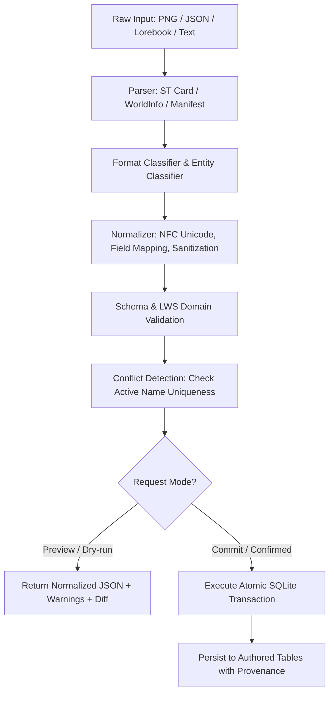

# Phase 11 Planning Artifact: Import, Normalization, and Authoring Workflow

## Status

**READY FOR USER REVIEW**

> [!IMPORTANT]
> **Implementation Authorization Gate:**
> Phase 11 implementation is **NOT** authorized by this planning task. Explicit user authorization of this completed planning document is required before implementation begins.

---

## 1. Phase Goal

Make existing SillyTavern and AI-RP content (Character Cards V1/V2/V3 in PNG/JSON, World Info / Lorebooks, Canonical LWS World Manifests, and Freeform text) fully usable in the Living World Simulator (LWS) by establishing a deterministic, provenance-preserving normalization pipeline, robust conflict detection, an AI-assisted normalization option, and a comprehensive authored bundle workflow—while strictly preserving the architectural boundary that external and model-generated content is untrusted and never directly mutates runtime simulation state.

---

## 2. Phase Scope

1. **SillyTavern Character Card Ingestion (V1, V2, V3 / PNG & JSON):**
   - Ingest character cards from raw JSON objects or PNG image metadata chunks (`tEXt:ccv3` and `tEXt:chara`).
   - Extract character attributes (`name`, `description`, `personality`, `scenario`, `first_mes`, `mes_example`, `creator_notes`, `system_prompt`, `tags`, `extensions`).
   - Extract embedded Character Books / Lorebooks if present.
   - Normalize into canonical `lws_characters` authored schema.
2. **SillyTavern World Info / Lorebook Ingestion:**
   - Ingest World Info JSON files containing dictionary or array `entries`.
   - Heuristically classify entries into LWS entity types: **World Rules**, **Locations**, **Factions**, **Lore / Flavor** (prompt config/extensions), and **Ambient Archetypes**.
   - Normalize entries into structured authored definitions.
3. **Canonical LWS World Manifest Bundles (JSON / YAML):**
   - Define and implement the canonical multi-entity export and import format (`spec: 'lws_world_manifest_v1'`).
   - Support atomic import and export of complete Worlds with characters, locations (hierarchies), factions, world rules, scenarios, ambient archetypes, and prompt configurations.
4. **AI-Assisted Normalization Service:**
   - Provide an optional AI-assisted extraction and structuring service for unstructured text, complex lorebooks, and freeform world descriptions using the Phase 10 generative bridge.
   - Enforce that AI extraction outputs are treated as strictly untrusted: parsed, schema-validated, domain-validated, and staged for user preview before persistence.
5. **Durable Provenance Tracking:**
   - Capture source format, source version, source filename/hash, mapping decisions, unmapped properties, warnings, and import timestamps in `extensions.provenance` on all created/updated authored entities.
6. **Conflict & Duplicate Detection:**
   - Detect active name collisions within the target World (`idx_lws_*_name_active` partial unique indexes).
   - Implement four deterministic resolution policies: `REJECT` (default), `RENAME`, `REPLACE`, and `MERGE`.
7. **Two-Stage Preview & Transactional Commit Workflow:**
   - Preview stage: Dry-run returning normalized canonical entities, validation status, conflict reports, and provenance metadata without database modification.
   - Commit stage: Atomic SQLite transaction persisting records into authored tables.
8. **Authored Model Integration & REST Transport:**
   - High-level authoring service orchestrating multi-entity validation and atomic persistence.
   - Thin REST endpoints mounted under `/api/living-world/import/*` and `/api/living-world/worlds/:worldLwsId/import/*`.

---

## 3. Non-Goals

- **UI / Frontend Implementation:** User interface screens, drawers, drag-and-drop file upload dialogs, and visual preview modals belong strictly to **Phase 12: Native SillyTavern User Workflow and UI**.
- **Runtime Simulation Mutation:** Importing a card or world NEVER instantiates a simulation or mutates `lws_simulations`, `lws_simulation_characters`, or `lws_events`.
- **Long-Run Regression Suites & Release Packaging:** Full-suite soak testing, disaster recovery, and release backup packaging belong strictly to **Phase 13: Replay, Hardening, Release Readiness, and Long-Run Verification**.
- **Automated Directory Sync:** LWS does not maintain an automated background file-watcher or live sync over SillyTavern's `data/default-user/characters/` folder; all imports are explicit, intentional user/API actions.
- **Core ST Refactoring:** Modifying SillyTavern's host card parsers (`src/character-card-parser.js`) or validator files (`src/validator/TavernCardValidator.js`) outside LWS boundaries.

---

## 4. Current Behavior & Evidence

- **Authored Foundation (Phase 2):** Authored domain services (`src/living-world/authored/`) support individual CRUD operations for `worlds`, `characters`, `locations`, `factions`, `world_rules`, `scenarios`, and `prompt_configs`.
- **Database Schema (Migration 002 & 009):** 9 authored tables exist with `user_version = 9`. All tables have `tags TEXT NOT NULL DEFAULT '[]'` and `extensions TEXT NOT NULL DEFAULT '{}'`.
- **Existing Limitation:** There are no endpoints or normalization pipelines to ingest SillyTavern character PNG cards, ST World Info JSON files, or multi-entity world manifests. Users must manually create every entity one by one through REST calls.
- **Host Tools Available:** SillyTavern provides PNG chunk extraction (`src/character-card-parser.js`), card structure validation (`src/validator/TavernCardValidator.js`), and World Info reading (`src/endpoints/worldinfo.js`), but they are currently disconnected from the LWS subsystem.

---

## 5. Desired Behavior



1. A single endpoint call (e.g. `POST /api/living-world/import/character/preview`) accepts a PNG buffer or JSON payload, extracts metadata, normalizes into canonical `lws_characters` shape, reports any conflicts/warnings, and allows instant committing to a target World (`POST /api/living-world/worlds/:worldLwsId/import/character`).
2. World Info files can be uploaded, classified, previewed, and committed as world rules, locations, factions, and archetypes with full provenance.
3. Complete worlds can be exported and imported as canonical LWS World Manifest bundles (`spec: 'lws_world_manifest_v1'`).
4. Ambiguous freeform text can be normalized with AI assistance using the Phase 10 generative bridge, while remaining strictly sandboxed, schema-validated, and reviewable.

---

## 6. Relevant Invariants

1. **LLM / External Proposes $\to$ Simulation Engine Decides $\to$ Database Records Reality:** External content and AI-generated normalization outputs are untrusted proposals that must pass schema and domain validation before entering the database.
2. **Authored vs. Runtime Separation (Domain Rules 5–7, ADR-006):** Authored data is static, reusable, and simulation-independent. Phase 11 mutates ONLY authored tables (`lws_worlds`, `lws_characters`, `lws_locations`, `lws_factions`, `lws_world_rules`, `lws_scenarios`, `lws_ambient_archetypes`, `lws_authored_prompt_configs`). It **NEVER** mutates runtime simulation tables (`lws_simulations`, `lws_simulation_characters`, `lws_events`, etc.).
3. **Provenance Preservation (Domain Rule 37, ADR-009):** Original source, format version, source filename/hash, mapping decisions, dropped properties, and warnings are permanently preserved in `extensions.provenance`.
4. **Missing Data Invariant (Domain Rule 37):** Missing fields remain missing (empty string/array or null). Normalization must never hallucinate or invent detail merely to populate optional schema fields.
5. **Non-Omniscience & Security (Domain Rules 8–13, 37–39):** Untrusted input parsing must defend against prototype pollution, path traversal, regex DoS, oversized payloads, and circular location hierarchies.

---

## 7. Existing SillyTavern Infrastructure to Reuse

- `src/character-card-parser.js`: `read(buffer)` extracting base64-encoded `ccv3` or `chara` PNG text chunks.
- `src/validator/TavernCardValidator.js`: `TavernCardValidator` verifying V1, V2, V3 specifications.
- `src/util.js`: `tryParse`, `safeJsonParse`, `deepMerge`, `clientRelativePath`.
- `sanitize-filename`: Safe filename sanitation for uploaded content.
- Express `multer` middleware: Memory/disk file upload buffering.
- ST Generation Provider Bridge (via Phase 10 `src/living-world/prompt/generation.js` / provider callbacks): For AI-assisted normalization.

---

## 8. Existing LWS Infrastructure to Reuse

- Authored domain services: `src/living-world/authored/` (`worlds.js`, `characters.js`, `locations.js`, `factions.js`, `world-rules.js`, `scenarios.js`, `prompt-configs.js`, `common.js`).
- Population archetypes: `src/living-world/population/archetypes.js`.
- Database layer: `src/living-world/db.js` (`getDb()`, atomic transactions).
- Error classes: `src/living-world/errors.js` (`LwsValidationError`, `LwsNotFoundError`, `LwsConflictError`, `LwsAuthorityError`).
- Output parsing & LLM bridge: `src/living-world/prompt/` (`output-parser.js`, `common.js`, `generation.js`).

---

## 9. Exact Modules / Files Affected

```text
src/living-world/
├── import/
│   ├── common.js              (NEW: format detection, sanitization, provenance builder)
│   ├── card-importer.js       (NEW: Character Card V1/V2/V3 parser, normalizer, extractor)
│   ├── worldinfo-importer.js  (NEW: World Info classifier, normalizer, rule/loc/faction extractor)
│   ├── manifest-importer.js   (NEW: Canonical LWS World Manifest parser, serializer, batch loader)
│   ├── ai-normalizer.js       (NEW: AI-assisted extraction service via Phase 10 bridge)
│   ├── conflicts.js           (NEW: Name collision detection and resolution policies)
│   └── authoring.js           (NEW: High-level authoring orchestrator & transaction manager)
├── index.js                   (MODIFIED: Re-export import and authoring services)
src/endpoints/
└── living-world.js            (MODIFIED: Mount import and authoring REST routes with multer)
docs/living-world/
├── IMPORT_AND_NORMALIZATION.md (MODIFIED: Updated comprehensive reference)
├── decisions/
│   └── ADR-019-import-normalization-and-authoring-workflow.md (NEW: Phase 11 ADR)
├── DOCUMENTATION_INDEX.md     (MODIFIED: Link ADR-019 and updated docs)
└── PROJECT_STATE.md           (MODIFIED: Update Phase 11 status)
tests/living-world/
├── lws-card-importer.test.js      (NEW: V1, V2, V3 JSON & PNG card import tests)
├── lws-worldinfo-importer.test.js (NEW: Lorebook parsing, classification, and extraction tests)
├── lws-manifest-importer.test.js  (NEW: Canonical LWS World Manifest round-trip tests)
├── lws-ai-normalizer.test.js      (NEW: AI-assisted extraction, parsing, and fallback tests)
├── lws-conflicts.test.js          (NEW: Reject, rename, replace, and merge collision tests)
├── lws-authoring-bundle.test.js   (NEW: Atomic transaction, rollback, and bundle tests)
├── lws-provenance.test.js         (NEW: Provenance capture and durability tests)
└── lws-import-api.test.js         (NEW: HTTP REST endpoint tests for all import paths)
```

---

## 10. Import Contract

### 10.1 Supported Source Formats & Versions

1. **SillyTavern Character Card (PNG / JSON):**
   - **V1 (Legacy):** Flat JSON object containing `name`, `description`, `personality`, `scenario`, `first_mes`, `mes_example`.
   - **V2 (Spec 2.0):** JSON object with `spec: 'chara_card_v2'`, `spec_version: '2.0'`, `data: { name, description, personality, scenario, first_mes, mes_example, creator_notes, system_prompt, post_history_instructions, alternate_greetings, character_book, tags, extensions }`.
   - **V3 (Spec 3.0):** JSON object with `spec: 'chara_card_v3'`, `spec_version: '3.0'`, `data: { name, description, personality, scenario, first_mes, mes_example, creator_notes, system_prompt, post_history_instructions, alternate_greetings, character_book, tags, assets, extensions }`.
   - **PNG Image:** Buffer containing `tEXt` chunks. Chunk keyword `ccv3` takes precedence over `chara`.
2. **SillyTavern World Info / Lorebook (JSON):**
   - JSON object with `entries: { [uid]: Entry }` or `entries: Entry[]`.
   - Entry shape: `{ uid, key: string[], keysecondary: string[], comment: string, content: string, constant: boolean, selective: boolean, order: number, position: number, disable: boolean, extensions: object }`.
3. **Canonical LWS World Manifest (JSON / YAML):**
   - `spec: 'lws_world_manifest_v1'`, `spec_version: '1.0'`.
   - Bundle object containing: `world`, `characters: []`, `locations: []`, `factions: []`, `world_rules: []`, `scenarios: []`, `ambient_archetypes: []`, `prompt_config: {}`.
4. **Freeform / Unstructured Text:**
   - Raw markdown or text descriptions processed via AI-assisted extraction.

### 10.2 Field Mapping Matrix (Character Cards)

| ST Field | LWS Authored Field | Normalization Rule |
|---|---|---|
| `data.name` or `name` | `name` | String, trimmed, 1–255 chars, Unicode NFC. Required. |
| `data.description` or `description` | `description` | String, trimmed, max 65535 chars. Default: `''`. |
| `data.personality` or `personality` | `personality` | String, trimmed, max 65535 chars. Default: `''`. |
| `data.scenario` or `scenario` | `scenario_context` | String, trimmed, max 65535 chars. Default: `''`. |
| `data.mes_example` or `mes_example` | `mes_example` | String, trimmed, max 65535 chars. Default: `''`. |
| `data.creator_notes` or `data.author_notes` | `author_notes` | String, trimmed, max 65535 chars. Default: `''`. |
| `data.system_prompt` or `system_prompt` | `system_prompt_override` | String, trimmed, max 65535 chars. Default: `''`. |
| `data.character_version` or `source_version` | `source_version` | String, trimmed, max 255 chars. Default: `''`. |
| `data.tags` or `tags` | `tags` | Array of strings, max 100 items, each $\le 64$ chars. Default: `[]`. |
| `data.first_mes` | `extensions.st_first_mes` | Preserved in extensions for scenario greeting generation. |
| `data.alternate_greetings` | `extensions.st_alternate_greetings` | Preserved in extensions. |
| `data.post_history_instructions` | `extensions.st_post_history_instructions` | Preserved in extensions. |
| `data.character_book` | Extracted World Rules / Factions | Extracted into world entities or preserved in `extensions.embedded_lorebook`. |
| `data.extensions` or other custom fields | `extensions.unmapped_fields` | Preserved in `extensions` object without data loss. |

---

## 11. Normalization Contract

### 11.1 The Seven-Stage Pipeline

```text
1. Parse:
   - Extract raw text/JSON from file upload or request payload.
   - Guard against prototype pollution and malformed JSON.

2. Classify:
   - Identify format: ST Card (V1/V2/V3/PNG), World Info, LWS Manifest, or Freeform Text.
   - For Lorebook entries: Heuristically classify into Location, Faction, World Rule, Lore, or Archetype.

3. Normalize:
   - Apply Unicode NFC normalization to all string values.
   - Strip null bytes, unprintable control characters (except standard newlines/tabs), and trailing whitespace.
   - Assign RFC 4122 UUID (`lws_id`).

4. Validate (Schema & Domain):
   - Enforce LWS domain rules (`validateName`, `validateTextField`, `validateTags`, `validateExtensions`).
   - Validate location hierarchy (parent location existence, same-world constraint, tree LCA cycle detection).

5. Conflict Detection:
   - Check active entity name uniqueness (`COLLATE NOCASE`) in target World.
   - Apply requested resolution policy (`REJECT`, `RENAME`, `REPLACE`, `MERGE`).

6. Provenance Assembly:
   - Construct comprehensive `extensions.provenance` object logging source type, hash, mappings, unmapped keys, and warnings.

7. Staging / Execution:
   - If preview mode: Return normalized entities, provenance, conflicts, and warnings in JSON response.
   - If commit mode: Execute inside a single SQLite transaction (`db.transaction(...)`). Roll back on any error.
```

### 11.2 Lorebook Entry Classification Heuristics

For SillyTavern World Info entries:
- **Location:** If entry comment or keys match location indicators (`location:`, `place:`, `city:`, `building:`, `room:`, `district:`) OR content describes spatial geometry/setting.
- **Faction:** If entry comment or keys match faction indicators (`faction:`, `group:`, `organization:`, `guild:`, `clan:`, `order:`).
- **Ambient Archetype:** If entry comment or keys match archetype indicators (`archetype:`, `ambient:`, `crowd:`, `npc_template:`).
- **World Rule:** If entry comment or keys match rule indicators (`rule:`, `law:`, `magic_system:`, `physics:`, `cosmology:`) OR entry is marked `constant: true`.
- **Lore / Flavor (Fallback):** Entries that do not match above categories are mapped to World Rules with tag `["lore"]` or stored in World Prompt Config style/premise instructions.

---

## 12. Authoring Workflow

### 12.1 Entity Lifecycle & Bundling

Users and client interfaces can author content through three complementary pathways:
1. **Single Entity CRUD:** Standard Phase 2 REST endpoints under `/api/living-world/worlds/:worldLwsId/*`.
2. **Multi-Entity Bundle Ingestion:** Atomic ingestion of complete worlds via `POST /api/living-world/import/manifest/commit`.
3. **Draft Preview & Refinement:** In-memory preview generation via `POST /api/living-world/import/*/preview` allowing client inspection and correction before committing.

### 12.2 World Export Workflow

The authoring system provides a full export endpoint:
`GET /api/living-world/worlds/:worldLwsId/export/manifest`
- Serializes the entire world and all active child entities into a single canonical LWS World Manifest JSON.
- Strips internal database primary keys (`id`, `world_id`).
- Formats all entities with public `lws_id` UUIDs.
- Includes embedded provenance and version metadata.
- Enables seamless backup, sharing, and re-import across different SillyTavern instances.

---

## 13. Persistence & Data Boundary

### 13.1 Schema Evaluation

- **Zero Schema Change Required:** All 9 Phase 2 authored tables (`lws_worlds`, `lws_characters`, `lws_locations`, `lws_factions`, `lws_character_factions`, `lws_world_rules`, `lws_scenarios`, `lws_scenario_characters`, `lws_authored_prompt_configs`) and the Phase 9 table (`lws_ambient_archetypes`) already possess `extensions TEXT NOT NULL DEFAULT '{}'`, `tags TEXT NOT NULL DEFAULT '[]'`, `created_at`, `updated_at`, and `deleted_at`.
- **Schema Version:** Remains `PRAGMA user_version = 9`.
- **No Migration Required:** Provenance and import metadata reside cleanly within structured `extensions.provenance` JSON columns. Staging and draft previews operate in-memory over HTTP request/response lifecycles, completely eliminating temporary database clutter or ephemeral table overhead.

### 13.2 State Boundary Enforcement

| Data Layer | Mutated in Phase 11? | Storage Location | Notes |
|---|---|---|---|
| **Authored Definitions** | **YES** | `lws_worlds`, `lws_characters`, `lws_locations`, etc. | Static, reusable authored records. |
| **Provenance Metadata** | **YES** | `extensions.provenance` JSON column | Immutable audit record inside authored rows. |
| **Simulation Runtime** | **NO** | `lws_simulations`, `lws_simulation_characters` | Never touched during import. |
| **Event Ledger** | **NO** | `lws_events`, `lws_narrative_turns` | No runtime events generated by authoring. |
| **Draft / Preview Data** | **NO** | In-Memory (HTTP Request / Response) | Ephemeral; never persisted to SQLite. |

---

## 14. Provenance Model

Every imported entity records structured provenance under `extensions.provenance`:

```json
{
  "provenance": {
    "source_type": "sillytavern_card_v2",
    "source_format": "png",
    "source_name": "Charlotte.png",
    "source_version": "2.0",
    "source_hash": "sha256:4f83b2a9...",
    "imported_at": "2026-09-26T14:30:00.000Z",
    "normalizer_version": "1.0",
    "field_mappings": {
      "name": "data.name",
      "description": "data.description",
      "personality": "data.personality",
      "scenario_context": "data.scenario",
      "author_notes": "data.creator_notes",
      "system_prompt_override": "data.system_prompt"
    },
    "unmapped_keys": ["alternate_greetings", "post_history_instructions"],
    "warnings": []
  }
}
```

---

## 15. Conflict Detection & Reimport Policy

When an entity with the same name (case-insensitive) already exists in the target World (`deleted_at IS NULL`), the caller must specify a `conflict_policy`:

1. **`REJECT` (Default):**
   - Fails immediately.
   - Throws `LwsConflictError` (HTTP 409 Conflict) listing the conflicting entity type, name, and existing `lws_id`.
2. **`RENAME`:**
   - Appends a deterministic incremental suffix (e.g. `Charlotte (Import 2)`, `Charlotte (Import 3)`).
   - Generates a fresh UUID and commits the entity.
3. **`REPLACE`:**
   - Soft-deletes the existing active entity (`deleted_at = isoNow()`).
   - Inserts the new entity with a fresh UUID.
   - *Safety Invariant:* Existing in-flight simulations referencing the old entity are protected because simulations hold frozen `authored_snapshot` JSON copies.
4. **`MERGE`:**
   - Updates the existing active entity in place (`updated_at = isoNow()`).
   - Non-empty imported fields overwrite existing fields; empty imported fields leave existing fields intact.
   - Merges tags (union) and appends import provenance history.

---

## 16. Security Model

1. **Path Traversal Protection:** All file uploads and import paths use `sanitize-filename` (`sanitizeSafeCharacterReplacements`). Files are processed in memory buffers or temporary upload paths with immediate unlinking upon processing.
2. **Prototype Pollution Guard:** All JSON parsing and object merging functions explicitly strip `__proto__`, `constructor`, and `prototype` properties.
3. **Payload Size Limits:** Upload and JSON body limits are capped at 10 MB.
4. **Regex Safety:** Character and word boundary regular expressions are strictly bounded to prevent catastrophic backtracking (ReDoS).
5. **Untrusted LLM Output Sandboxing:** AI-assisted normalization runs through `parseModelResponse`, strict JSON schema validation, and LWS domain validation. Validation failures reject the proposal with HTTP 422 before any database execution.
6. **SQL Injection Defense:** 100% of database queries use parameterized SQL bindings.

---

## 17. API / Service Contract

### 17.1 REST Endpoints

| Method | Route | Description | Request Body | Success Response |
|---|---|---|---|---|
| `POST` | `/api/living-world/import/character/preview` | Preview ST Card import | `multipart/form-data` (file) OR JSON `{ card: object }` | `200 OK` `{ normalized: object, provenance: object, conflicts: object[], warnings: string[] }` |
| `POST` | `/api/living-world/worlds/:worldLwsId/import/character` | Commit ST Card to World | `{ card?: object, file_path?: string, conflict_policy?: string }` (or `multipart/form-data`) | `201 Created` `{ character: object }` |
| `POST` | `/api/living-world/import/worldinfo/preview` | Preview World Info import | `multipart/form-data` (file) OR JSON `{ worldinfo: object }` | `200 OK` `{ entities: { rules: [], locations: [], factions: [], archetypes: [] }, warnings: string[] }` |
| `POST` | `/api/living-world/worlds/:worldLwsId/import/worldinfo` | Commit World Info to World | `{ worldinfo: object, conflict_policy?: string }` | `201 Created` `{ imported_counts: object, entities: object }` |
| `POST` | `/api/living-world/import/manifest/preview` | Preview World Manifest import | JSON `{ manifest: object }` | `200 OK` `{ valid: boolean, summary: object, conflicts: object[], warnings: string[] }` |
| `POST` | `/api/living-world/import/manifest/commit` | Commit complete World Manifest | `{ manifest: object, conflict_policy?: string }` | `201 Created` `{ world: object, counts: object }` |
| `GET` | `/api/living-world/worlds/:worldLwsId/export/manifest` | Export complete World Manifest | Query: `?format=json` | `200 OK` `{ spec: 'lws_world_manifest_v1', world: object, ... }` |
| `POST` | `/api/living-world/import/ai-assist` | AI-assisted text normalization | `{ text: string, target_types?: string[] }` | `200 OK` `{ extracted_entities: object, warnings: string[] }` |

---

## 18. Event & Authority Implications

- **No Runtime Simulation Events:** Authoring and import actions do not produce `lws_events` ledger rows. The event ledger is strictly reserved for runtime simulation state transitions (`PRAGMA user_version = 4..9`).
- **Database Boundary Hardening:** Authored database triggers (`trg_lws_*_world_id_immutable`, `trg_lws_locations_parent_world`, cross-world join triggers) execute automatically during import commits, preventing invalid or cross-world linkages.

---

## 19. Test Strategy

Phase 11 verification uses automated unit and integration tests under `tests/living-world/` executing via the standard Node.js test runner (`npm test`). Browser automation is strictly prohibited per project rules.

### 19.1 Planned Test Suites

1. `tests/living-world/lws-card-importer.test.js`:
   - V1 legacy JSON card parsing and field normalization.
   - V2 specification card parsing, field mappings, tags, extensions, and embedded lorebook extraction.
   - V3 specification card parsing, assets, and extensions.
   - PNG image metadata extraction (`tEXt:ccv3` priority over `tEXt:chara`).
   - Missing fields defaulting to empty without hallucination.
2. `tests/living-world/lws-worldinfo-importer.test.js`:
   - ST World Info dictionary format parsing (`entries: { "1": {...} }`).
   - ST World Info array format parsing (`entries: [...]`).
   - Entry classification heuristics (Rules, Locations, Factions, Archetypes, Lore).
   - Sanitization and Unicode NFC normalization.
3. `tests/living-world/lws-manifest-importer.test.js`:
   - Full round-trip export $\to$ import parity verification.
   - Multi-entity relational integrity (characters $\to$ factions, locations $\to$ parent locations, scenarios $\to$ starting locations).
   - Rejection of malformed manifests (missing required fields, circular location trees).
4. `tests/living-world/lws-ai-normalizer.test.js`:
   - Freeform text parsing via mocked LLM bridge.
   - Sandboxing of invalid/malformed LLM proposals (syntax errors, invalid types).
   - Domain validation enforcement before database staging.
5. `tests/living-world/lws-conflicts.test.js`:
   - `REJECT` policy: Throws 409 on name collision.
   - `RENAME` policy: Generates unique suffixed name and persists successfully.
   - `REPLACE` policy: Soft-deletes existing record and creates new record.
   - `MERGE` policy: In-place field updates and tag unioning.
6. `tests/living-world/lws-authoring-bundle.test.js`:
   - Atomic multi-entity transactions (all-or-nothing rollback on partial failure).
   - Prototype pollution defense tests (`__proto__`, `constructor` injection).
   - Soft-delete relationship preservation.
7. `tests/living-world/lws-provenance.test.js`:
   - Verification of `extensions.provenance` structure and field immutability.
   - SHA-256 source hash verification and timestamp logging.
8. `tests/living-world/lws-import-api.test.js`:
   - HTTP REST route testing for all 8 import endpoints with valid, malformed, and conflicting payloads.

---

## 20. Acceptance Criteria & Matrix

| # | Criterion | Observable Behavior | Implementation Evidence | Verification Evidence | Pass Condition |
|---|---|---|---|---|---|
| **1** | **Character Card V1/V2/V3 Import** | Ingesting a V1, V2, or V3 card JSON or PNG produces a valid `lws_characters` authored row with mapped fields. | `src/living-world/import/card-importer.js` | `tests/living-world/lws-card-importer.test.js` | All standard fields mapped correctly; missing fields remain empty; provenance recorded. |
| **2** | **PNG Metadata Extraction** | Uploading a PNG character card extracts embedded `ccv3`/`chara` metadata chunk accurately. | `src/living-world/import/card-importer.js` | `tests/living-world/lws-card-importer.test.js` | Base64 decoded chunk parsed into character; invalid PNGs reject with 400. |
| **3** | **World Info / Lorebook Ingestion** | Ingesting a World Info JSON file classifies entries into rules, locations, factions, and archetypes. | `src/living-world/import/worldinfo-importer.js` | `tests/living-world/lws-worldinfo-importer.test.js` | Entries classified per heuristics; valid authored records created in target world. |
| **4** | **Canonical Manifest Round-Trip** | Exporting a world produces valid `lws_world_manifest_v1` JSON; importing it restores all entities with 100% relational parity. | `src/living-world/import/manifest-importer.js` | `tests/living-world/lws-manifest-importer.test.js` | Exported manifest imports into a fresh world with zero relational broken links or data loss. |
| **5** | **AI-Assisted Normalization Sandboxing** | Freeform text extraction through AI assistant validates against LWS domain rules before persistence. | `src/living-world/import/ai-normalizer.js` | `tests/living-world/lws-ai-normalizer.test.js` | Valid LLM output is structured; invalid LLM output fails closed with 422 and zero DB mutation. |
| **6** | **Conflict Resolution Policies** | Name collisions are handled per requested policy (`reject`, `rename`, `replace`, `merge`). | `src/living-world/import/conflicts.js` | `tests/living-world/lws-conflicts.test.js` | `REJECT` returns 409; `RENAME` creates `... (Import 2)`; `REPLACE` soft-deletes old; `MERGE` updates fields. |
| **7** | **Durable Provenance Logging** | All imported records contain structured provenance in `extensions.provenance`. | `src/living-world/import/common.js` | `tests/living-world/lws-provenance.test.js` | `source_type`, `source_hash`, `field_mappings`, and `imported_at` are persisted and retrievable. |
| **8** | **Atomic Transactional Rollback** | An import bundle containing an invalid entity rolls back entirely without leaving orphan records. | `src/living-world/import/authoring.js` | `tests/living-world/lws-authoring-bundle.test.js` | Failure during batch import results in 0 rows inserted into any table. |
| **9** | **Zero Runtime Mutation Boundary** | Executing any import operation creates 0 rows in simulation runtime tables (`lws_simulations`, `lws_events`, etc.). | `src/living-world/import/authoring.js` | `tests/living-world/lws-authoring-bundle.test.js` | Runtime table row counts remain completely identical before and after import. |
| **10** | **REST API Contract & Security** | All 8 REST routes respond with correct HTTP status codes, validating auth and sanitizing inputs against prototype pollution. | `src/endpoints/living-world.js` | `tests/living-world/lws-import-api.test.js` | All routes return expected payloads; prototype pollution attempts stripped; 100% tests pass. |

---

## 21. Risks and Rollback

| Risk | Impact | Mitigation Strategy |
|---|---|---|
| **Corrupted / Malformed Card Upload** | Application crash or 500 error | Wrap parsing in `try/catch` and `TavernCardValidator`; fail closed with clean HTTP 400. |
| **Name Collision on Import** | Database trigger failure / unique constraint violation | Proactive pre-insert collision check with configured policy (`reject`, `rename`, `replace`, `merge`). |
| **Prototype Pollution via JSON Import** | Server vulnerability | Enforce deep sanitization stripping `__proto__`, `constructor`, `prototype` in `common.js`. |
| **Large Lorebook Processing Overhead** | Server event-loop blocking | Impose 10 MB payload limit and stream-friendly synchronous parsing inside bounded transactions. |
| **Accidental Runtime Mutation** | Simulation desynchronization | Import services import only authored domain services (`src/living-world/authored/`); zero runtime service imports. |

**Rollback Strategy:**
Since Phase 11 requires zero SQLite schema migrations (`PRAGMA user_version = 9`), rollback is completely clean and instantaneous via Git commit reversion.

---

## 22. Implementation Order

1. **Phase 11 Planning Authorization:** Present planning artifact for formal user review and await explicit authorization.
2. **Import Common & Security Utilities (`src/living-world/import/common.js`):** Implement format classification, Unicode NFC normalization, text sanitization, prototype pollution filtering, and provenance builder.
3. **Character Card Importer (`src/living-world/import/card-importer.js`):** Implement V1, V2, V3 JSON and PNG metadata parser and field mapping logic.
4. **World Info Importer (`src/living-world/import/worldinfo-importer.js`):** Implement lorebook parser, classification heuristics, and entity extraction.
5. **Canonical Manifest Importer & Serializer (`src/living-world/import/manifest-importer.js`):** Implement `lws_world_manifest_v1` export serializer and batch import parser.
6. **Conflict Resolution Service (`src/living-world/import/conflicts.js`):** Implement `reject`, `rename`, `replace`, and `merge` collision handlers.
7. **AI-Assisted Normalizer (`src/living-world/import/ai-normalizer.js`):** Implement unstructured text extraction bridge using Phase 10 generation integration.
8. **Authoring & Transaction Orchestrator (`src/living-world/import/authoring.js`):** Implement atomic multi-entity transaction manager and validation pipeline.
9. **REST API Transport (`src/endpoints/living-world.js`):** Mount 8 import and authoring endpoints with multer upload middleware.
10. **Subsystem Integration (`src/living-world/index.js`):** Export import and authoring domain functions.
11. **Comprehensive Test Suite Implementation (`tests/living-world/`):** Implement 8 dedicated test suites verifying all 10 acceptance criteria.
12. **Documentation & ADR Update:** Author ADR-019, update `IMPORT_AND_NORMALIZATION.md`, `DOCUMENTATION_INDEX.md`, `AI_CHANGELOG.md`, and `PROJECT_STATE.md`.
13. **Phase-Level Verification:** Execute full test suites (`npm test`) and static checks to prove zero regressions across Phases 1–10.

---

## 23. Cross-Phase Consistency

- **Phase 1 Host Foundation:** Reuses standard ST server lifecycle and logging.
- **Phase 2 Authored Model:** Ingests data directly into the canonical Phase 2 tables without schema modifications.
- **Phases 3–9 Simulation Runtime & Living World:** Strict separation maintained; runtime tables are untouched during import.
- **Phase 10 Prompt & Generation Integration:** Reuses Phase 10 provider connection and output parsing for AI-assisted extraction.
- **Future Phase 12 Native ST UI:** Provides clean, well-documented REST endpoints ready for the UI drawers and import wizards in Phase 12.
- **Future Phase 13 Release Readiness:** Ensures all authored models are fully exportable and verifiable for backup and release workflows.

---

## 24. Decision Register

| Decision ID | Question | Options Considered | Decision & Rationale | Status |
|---|---|---|---|---|
| **DEC-1101** | Database Schema Migration for Import? | A: Add import tables (`lws_import_batches`).<br>B: Zero schema change; store provenance in `extensions.provenance` and use in-memory preview. | **Option B (Zero Schema Change):** All authored tables already support `extensions TEXT`. Storing provenance in JSON extensions and previewing in-memory avoids database bloat and preserves `PRAGMA user_version = 9`. | **ACCEPTED** |
| **DEC-1102** | Character Card V3 Support | A: V2 only.<br>B: Support V1, V2, and V3 (PNG chunks `ccv3` and `chara`). | **Option B (Full V1/V2/V3 Support):** Maximizes compatibility with modern SillyTavern character libraries. | **ACCEPTED** |
| **DEC-1103** | Default Conflict Resolution Policy | A: Automatically overwrite (`REPLACE`).<br>B: Fail closed (`REJECT`) with 409 Conflict. | **Option B (`REJECT` Fail-Safe):** Protects existing authored definitions from unintended silent overwrites. Callers can explicitly select `RENAME`, `REPLACE`, or `MERGE`. | **ACCEPTED** |
| **DEC-1104** | Handling Embedded Lorebooks in Character Cards | A: Discard embedded lorebooks.<br>B: Extract into World Rules/Factions and log extraction in provenance. | **Option B (Extract with Provenance):** Preserves rich character background lore while ensuring it enters LWS as structured authored entities. | **ACCEPTED** |
| **DEC-1105** | AI-Assisted Normalization Authority Boundary | A: LLM writes directly to SQLite.<br>B: LLM produces proposal; LWS parses, validates against domain rules, and returns preview before commit. | **Option B (Untrusted Proposal Sandboxing):** Strictly enforces Core Invariant $\mathbf{LLM\ proposes \to LWS\ validates \to Database\ records}$. | **ACCEPTED** |

---

## 25. Implementation Authorization Gate

> [!CAUTION]
> **Phase 11 implementation is NOT authorized by this planning task. Explicit user authorization is required before implementation begins.**
