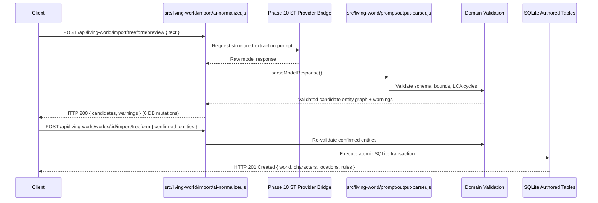

# Phase 11 Planning Artifact: Import, Normalization, and Authoring Workflow

## Status

**READY FOR USER REVIEW**

> [!IMPORTANT]
> **Implementation Authorization Gate:**
> Phase 11 implementation is **NOT** authorized by this planning task. Explicit user authorization of this completed planning document is required before implementation begins.

---

## 1. Phase Goal

Make existing SillyTavern and AI-RP content (Character Cards V1/V2/V3 in PNG/JSON, World Info / Lorebooks, Canonical LWS World Manifests, and Freeform text) fully usable in the Living World Simulator (LWS) by establishing a deterministic, provenance-preserving normalization pipeline, robust conflict detection, an AI-assisted normalization option, and a comprehensive authored bundle workflow—while strictly preserving the architectural boundary that external and model-generated content is untrusted and never directly mutates runtime simulation state.

---

## 2. Phase Scope

1. **SillyTavern Character Card Ingestion (V1, V2, V3 / PNG & JSON):**
   - Ingest character cards from raw JSON objects or PNG image metadata chunks (`tEXt:ccv3` taking precedence over `tEXt:chara`).
   - Extract character attributes (`name`, `description`, `personality`, `scenario`, `first_mes`, `mes_example`, `creator_notes`, `system_prompt`, `tags`, `extensions`).
   - Extract embedded Character Books / Lorebooks if present, classifying entries with provenance.
   - Normalize into canonical `lws_characters` authored schema.
2. **SillyTavern World Info / Lorebook Ingestion:**
   - Ingest World Info JSON files containing dictionary or array `entries`.
   - Classify entries into LWS entity types: **World Rules**, **Locations**, **Factions**, **Lore / Flavor** (prompt config/extensions), and **Ambient Archetypes**.
   - Preserve non-rule lore entries as narrative background flavor rather than automatically turning arbitrary lore text into physical world rules.
3. **Freeform World / Scenario / Narrative Text Ingestion:**
   - Parse Markdown, YAML-frontmatter outlines, or unstructured prose into candidate World, Characters, Locations, Rules, and Scenarios.
   - Utilize AI-assisted extraction for unstructured prose while enforcing strict schema and domain validation before staging for user preview.
4. **Canonical LWS World Manifest Bundles (JSON / YAML):**
   - Define and implement the canonical multi-entity interchange format (`spec: 'lws_world_manifest_v1'`, `spec_version: '1.0'`).
   - Support atomic import and export of complete Worlds with characters, location hierarchies, factions, world rules, scenarios, ambient archetypes, and prompt configurations.
5. **Durable Provenance Tracking:**
   - Capture source format, source version, source filename/hash, mapping decisions, unmapped properties, warnings, and import timestamps in `extensions.provenance` on all created/updated authored entities (and in World-level component manifests for entities without direct `extensions` columns).
6. **Conflict & Duplicate Detection:**
   - Detect active name collisions within the target World (`idx_lws_*_name_active` partial unique indexes).
   - Implement four deterministic resolution policies: `REJECT` (default), `RENAME`, `REPLACE`, and `MERGE`.
7. **Two-Stage Preview & Transactional Commit Workflow:**
   - Preview stage: Dry-run returning normalized canonical entities, validation status, conflict reports, and provenance metadata without database modification.
   - Commit stage: Atomic SQLite transaction persisting records into authored tables.
8. **Authored Model Integration & REST Transport:**
   - High-level authoring service orchestrating multi-entity validation and atomic persistence.
   - Thin REST endpoints mounted under `/api/living-world/import/*` and `/api/living-world/worlds/:worldLwsId/import/*`.

---

## 3. Non-Goals

- **UI / Frontend Implementation:** User interface screens, drawers, drag-and-drop file upload dialogs, and visual preview modals belong strictly to **Phase 12: Native SillyTavern User Workflow and UI**.
- **Runtime Simulation Mutation:** Importing a card or world NEVER instantiates a simulation or mutates `lws_simulations`, `lws_simulation_characters`, or `lws_events`.
- **Long-Run Regression Suites & Release Packaging:** Full-suite soak testing, disaster recovery, and release backup packaging belong strictly to **Phase 13: Replay, Hardening, Release Readiness, and Long-Run Verification**.
- **Automated Directory Sync:** LWS does not maintain an automated background file-watcher or live sync over SillyTavern's `data/default-user/characters/` folder; all imports are explicit, intentional user/API actions.
- **Optional Archive Formats:** BYAF (`.byaf`) multi-character packs and CharX (`.charx`) archive packages with embedded voice/sprite packs remain future work.
- **Core ST Refactoring:** Modifying SillyTavern's host card parsers (`src/character-card-parser.js`) or validator files (`src/validator/TavernCardValidator.js`) outside LWS boundaries.

---

## 4. Current Behavior & Evidence

- **Authored Foundation (Phase 2):** Authored domain services (`src/living-world/authored/`) support individual CRUD operations for `worlds`, `characters`, `locations`, `factions`, `world_rules`, `scenarios`, and `prompt_configs`.
- **Database Schema (Migration 002 & 009):** 10 authored tables exist with `user_version = 9`.
- **Existing Limitation:** There are no endpoints or normalization pipelines to ingest SillyTavern character PNG cards, ST World Info JSON files, or multi-entity world manifests. Users must manually create every entity one by one through REST calls.
- **Host Tools Available:** SillyTavern provides PNG chunk extraction (`src/character-card-parser.js`), card structure validation (`src/validator/TavernCardValidator.js`), World Info reading (`src/endpoints/worldinfo.js`), and global upload handling via `multer` (`src/server-main.js`).

---

## 5. Architectural Invariants

1. **$\mathbf{LLM / External\ Proposes \to Simulation\ Engine\ Decides \to Database\ Records\ Reality \to Narrative\ Presents\ Reality}$:** External content and AI-generated normalization outputs are untrusted proposals that must pass schema and domain validation before entering the database.
2. **Authored vs. Runtime Separation (Domain Rules 5–7, ADR-006):** Authored data is static, reusable, and simulation-independent. Phase 11 mutates ONLY authored tables. It **NEVER** mutates runtime simulation tables (`lws_simulations`, `lws_simulation_characters`, `lws_events`, etc.).
3. **Provenance Preservation (Domain Rule 37, ADR-009):** Original source, format version, source filename/hash, mapping decisions, dropped properties, and warnings are permanently preserved.
4. **Missing Data Invariant (Domain Rule 37):** Missing fields remain missing (empty string/array or null). Normalization must never hallucinate or invent detail merely to populate optional schema fields.
5. **Lore is Not Physical Reality (Domain Rule 10, IMPORT_AND_NORMALIZATION.md):** Arbitrary lorebook text, background descriptions, and flavor lore do not automatically become physical world constraints or authoritative world rules.
6. **Non-Omniscience & Security (Domain Rules 8–13, 37–39):** Untrusted input parsing must defend against prototype pollution, path traversal, regex DoS, oversized payloads, and circular location hierarchies.

---

## 6. Comprehensive Schema Audit (P0 Audit Resolution)

### 6.1 Column-by-Column Table Audit

| Table Name | Entity Class | Schema Migration | Columns in Database | Has `extensions` Column? |
|---|---|---|---|:---:|
| `lws_worlds` | Root Entity | 002 | `id`, `lws_id`, `name`, `description`, `tags`, `extensions`, `created_at`, `updated_at`, `deleted_at` | **YES** |
| `lws_characters` | Authored Entity | 002 | `id`, `lws_id`, `world_id`, `name`, `description`, `personality`, `scenario_context`, `mes_example`, `author_notes`, `system_prompt_override`, `source_version`, `tags`, `extensions`, `created_at`, `updated_at`, `deleted_at` | **YES** |
| `lws_locations` | Authored Entity | 002 | `id`, `lws_id`, `world_id`, `parent_location_id`, `name`, `description`, `tags`, `extensions`, `created_at`, `updated_at`, `deleted_at` | **YES** |
| `lws_factions` | Authored Entity | 002 | `id`, `lws_id`, `world_id`, `name`, `description`, `tags`, `extensions`, `created_at`, `updated_at`, `deleted_at` | **YES** |
| `lws_scenarios` | Authored Entity | 002 | `id`, `lws_id`, `world_id`, `name`, `description`, `starting_location_id`, `tags`, `extensions`, `created_at`, `updated_at`, `deleted_at` | **YES** |
| `lws_authored_prompt_configs` | Authored Config | 002 | `id`, `lws_id`, `world_id`, `style_notes`, `tone_notes`, `format_notes`, `extensions`, `created_at`, `updated_at` | **YES** |
| `lws_world_rules` | Authored Rule | 002 | `id`, `lws_id`, `world_id`, `sort_order`, `title`, `body`, `created_at`, `updated_at`, `deleted_at` | **NO** |
| `lws_character_factions` | Join Table | 002 | `character_id`, `faction_id`, `role` | **NO** |
| `lws_scenario_characters` | Join Table | 002 | `scenario_id`, `character_id`, `role` | **NO** |
| `lws_ambient_archetypes` | Authored Archetype | 009 | `id`, `lws_id`, `world_id`, `archetype_key`, `entity_kind`, `role_title`, `name_pool`, `description_template`, `default_activities`, `location_tags`, `time_windows`, `weather_compat`, `spawn_weight`, `max_concurrent_instances`, `created_at`, `updated_at`, `deleted_at` | **NO** |

### 6.2 Provenance Storage Architecture & Zero-Schema-Change Proof

- **Direct Entity Provenance:** For `lws_worlds`, `lws_characters`, `lws_locations`, `lws_factions`, `lws_scenarios`, and `lws_authored_prompt_configs`, provenance is stored directly in their respective `extensions.provenance` JSON column.
- **World-Level Component Manifest Provenance:** For `lws_world_rules`, `lws_ambient_archetypes`, and join table associations (which do not possess dedicated `extensions` columns in Migration 002/009), provenance is persisted at the root World level inside `lws_worlds.extensions.provenance.imported_components`:
  ```json
  {
    "provenance": {
      "source_type": "sillytavern_worldinfo",
      "source_hash": "sha256:abc...",
      "imported_at": "2026-09-26T15:00:00.000Z",
      "imported_components": {
        "world_rules": {
          "rule-uuid-1": { "source_uid": 12, "source_key": "gravity", "confidence": 0.95 }
        },
        "ambient_archetypes": {
          "arch-uuid-1": { "source_uid": 18, "source_key": "guards", "confidence": 0.85 }
        }
      }
    }
  }
  ```
- **Extracted Lorebook Provenance on Characters:** When a character card contains an embedded lorebook whose entries are extracted as world rules or factions, the character's `extensions.provenance.extracted_lorebook_entries` records the cross-entity lineage.
- **Conclusion:** Zero database migrations are required (`PRAGMA user_version = 9` preserved). Full, lossless provenance is guaranteed without modifying table structures.

---

## 7. Conflict Detection & Reimport Semantics (P0 Resolution)

The canonical rule from `IMPORT_AND_NORMALIZATION.md` is strictly enforced:
*“Record the conflict and provenance; do not silently choose.”*

### 7.1 Conflict Resolution Policies

| Policy | Deterministic? | User Confirmation Required? | Behavior on Active Name Collision (`WHERE deleted_at IS NULL`) | Provenance Action |
|---|:---:|:---:|---|---|
| **`REJECT`** (Default) | Yes | No | Rejects the import with HTTP 409 Conflict. Zero database mutations. | Returns conflict details to caller for review. |
| **`RENAME`** | Yes | Yes (Explicit param) | Appends an incremental suffix: `Name (Import 2)`, `Name (Import 3)`. Inserts new row with fresh UUID. | Logs `{ policy: 'rename', original_name: 'Name', assigned_name: 'Name (Import 2)', colliding_lws_id: '...' }` in `provenance.conflict_resolution`. |
| **`REPLACE`** | Yes | Yes (Explicit confirmation) | Soft-deletes existing active record (`deleted_at = isoNow()`). Inserts new record with fresh UUID. | Logs `{ policy: 'replace', replaced_lws_id: '...', replaced_name: 'Name' }` in `provenance.conflict_resolution`. |
| **`MERGE`** | Yes | Yes (Explicit confirmation) | Updates existing active record in place (`updated_at = isoNow()`). See entity-specific merge rules below. | Appends new import record to `provenance.import_history: []`, retaining multi-import lineage. |

### 7.2 Entity-Specific Merge Semantics

When `MERGE` is selected:
- **`lws_characters`:**
  - `name`: Preserved from existing entity.
  - `description`, `personality`, `scenario_context`, `mes_example`, `author_notes`, `system_prompt_override`: Overwritten only if imported field is non-empty; empty imported fields leave existing values intact.
  - `source_version`: Updated to imported version if provided.
  - `tags`: Set union (`Array.from(new Set([...existingTags, ...importedTags]))`).
  - `extensions`: Deep merge with prototype pollution stripping.
- **`lws_locations`:**
  - `description`: Overwritten if imported non-empty.
  - `parent_location_id`: Updated only if explicitly specified in imported manifest and validated acyclic.
  - `tags`, `extensions`: Merged.
- **`lws_factions`:**
  - `description`: Overwritten if imported non-empty.
  - `tags`, `extensions`: Merged.
- **`lws_scenarios`:**
  - `description`, `starting_location_id`: Overwritten if non-empty / specified.
  - `tags`, `extensions`: Merged.

---

## 8. Authored Replacement Semantics for Active Simulations (P0 Resolution)

When an authored Character, World, Location, Scenario, Faction, or Rule is replaced or soft-deleted, existing in-flight simulations are protected by the following architectural mechanisms:

```text
[Authored Layer]
lws_characters (id: 42, lws_id: "char-uuid-old", deleted_at: "2026-09-26T15:30:00Z")
lws_characters (id: 99, lws_id: "char-uuid-new", deleted_at: NULL)

[Runtime Simulation Layer - Isolated]
lws_simulation_characters (
    id: 101,
    simulation_id: 1,
    character_id: 42,  <-- Points to historical integer ID (row is never physically deleted)
    authored_snapshot: "{ 'name': 'Charlotte', 'personality': '...' }" <-- Frozen immutable JSON
)
```

1. **Snapshot Immutability (ADR-011):** At simulation instantiation, `lws_simulation_characters` captures and freezes an `authored_snapshot` JSON string. Trigger `trg_lws_sim_chars_authored_snapshot_immutable` prohibits mutation.
2. **Physical Row Retention:** Soft-deleting an authored entity sets `deleted_at = isoNow()`. The physical SQLite row remains intact; foreign keys (`REFERENCES lws_characters(id)`) remain valid.
3. **Simulation Continuity:** Active simulations continue executing events, prompt building, and perception filtering using their frozen `authored_snapshot` and runtime tables without state collision.
4. **New Timeline Gating:** New simulation creation queries filter with `WHERE deleted_at IS NULL`, ensuring only currently active authored entities are instantiated in new simulations.

---

## 9. Freeform World / Scenario Import Architecture (P0 Resolution)

Freeform text / world / scenario ingestion is implemented as a dedicated subsystem in `src/living-world/import/freeform-importer.js` cooperating with `ai-normalizer.js`:

```text
Freeform Text / Markdown / Prose Outline
                ↓
1. Parser & Boundary Chunking (src/living-world/import/freeform-importer.js)
   - Splits on Markdown headers (## Characters, ## Locations, ## Lore, ## Starting Scenario).
                ↓
2. AI-Assisted Structuring (src/living-world/import/ai-normalizer.js)
   - Invokes Phase 10 provider bridge with structured output schema.
                ↓
3. JSON Schema & LWS Domain Validation
   - Runs validateName, validateTextField, Tree LCA cycle check.
                ↓
4. Preview Generation (POST /api/living-world/import/freeform/preview)
   - Returns candidate canonical World, Characters, Locations, Rules, Scenarios + diffs + warnings.
   - ZERO database mutations.
                ↓
5. Explicit User Confirmation (POST /api/living-world/worlds/:worldLwsId/import/freeform)
   - User submits reviewed candidate JSON with selected conflict policy.
                ↓
6. Atomic SQLite Transaction Persistence
```

---

## 10. Canonical LWS World Manifest Specification (`lws_world_manifest_v1`) (P1 Resolution)

### 10.1 Classification & Justification
- **Classification:** Scope Clarification / Canonical Interchange Standard.
- **Justification:** Fulfills the Phase 11 roadmap requirement for "authored world/character creation workflow" and "canonical LWS entities are valid and reusable," enabling lossless backup, sharing, and batch importing of complex worlds.

### 10.2 Manifest Schema Definition

```json
{
  "spec": "lws_world_manifest_v1",
  "spec_version": "1.0",
  "exported_at": "2026-09-26T15:00:00.000Z",
  "world": {
    "lws_id": "world-uuid",
    "name": "Eldoria",
    "description": "High fantasy realm",
    "tags": ["fantasy", "magic"],
    "extensions": {}
  },
  "prompt_config": {
    "style_notes": "Literary fantasy",
    "tone_notes": "Mysterious",
    "format_notes": "Third-person past tense",
    "extensions": {}
  },
  "characters": [
    {
      "lws_id": "char-uuid-1",
      "name": "Charlotte",
      "description": "Court mage",
      "personality": "Perceptive, cautious",
      "scenario_context": "Investigating anomalies",
      "mes_example": "<START>...",
      "author_notes": "Key NPC",
      "system_prompt_override": "",
      "source_version": "1.0",
      "tags": ["mage", "court"],
      "extensions": {}
    }
  ],
  "locations": [
    {
      "lws_id": "loc-uuid-1",
      "parent_location_lws_id": null,
      "name": "Capital City",
      "description": "Seat of the realm",
      "tags": ["city"],
      "extensions": {}
    }
  ],
  "factions": [
    {
      "lws_id": "fac-uuid-1",
      "name": "Mages Guild",
      "description": "Arcane order",
      "tags": ["guild"],
      "extensions": {}
    }
  ],
  "character_factions": [
    {
      "character_lws_id": "char-uuid-1",
      "faction_lws_id": "fac-uuid-1",
      "role": "Archivist"
    }
  ],
  "world_rules": [
    {
      "lws_id": "rule-uuid-1",
      "sort_order": 1,
      "title": "Law of Conservation of Magic",
      "body": "Magic requires physical catalyst."
    }
  ],
  "ambient_archetypes": [
    {
      "lws_id": "arch-uuid-1",
      "archetype_key": "city_guard",
      "entity_kind": "person",
      "role_title": "City Guard",
      "name_pool": ["Guard Thomas", "Guard Rowan"],
      "description_template": "A vigilant guard in iron armor.",
      "default_activities": ["patrolling"],
      "location_tags": ["city", "gate"],
      "time_windows": ["morning", "afternoon", "evening"],
      "spawn_weight": 60,
      "max_concurrent_instances": 3
    }
  ],
  "scenarios": [
    {
      "lws_id": "scen-uuid-1",
      "name": "The Arcane Breach",
      "description": "A tear in the barrier appears.",
      "starting_location_lws_id": "loc-uuid-1",
      "tags": ["investigation"],
      "extensions": {},
      "scenario_characters": [
        {
          "character_lws_id": "char-uuid-1",
          "role": "Lead Investigator"
        }
      ]
    }
  ]
}
```

### 10.3 Round-Trip Guarantees
Exporting a world via `GET /api/living-world/worlds/:worldLwsId/export/manifest` and re-importing it into a fresh world via `POST /api/living-world/import/manifest/commit` guarantees 100% attribute parity across all active authored entity fields and internal relational linkages (re-mapped via public `lws_id` UUIDs).

---

## 11. Character Card Compatibility Scope (P1 Resolution)

| Specification / Format | Phase 11 Status | Parser & Validator | Normalization & Mapping | Failure / Unsupported Handling |
|---|:---:|---|---|---|
| **Character Card V1 (JSON)** | Supported | JSON parse + `TavernCardValidator.validateV1()` | Maps flat `name`, `description`, `personality`, `scenario`, `mes_example`, `first_mes`. | Rejects if required fields missing (HTTP 400). |
| **Character Card V2 (JSON)** | Supported | JSON parse + `TavernCardValidator.validateV2()` | Maps `data.*` fields; extracts `character_book` if present. | Rejects if `spec_version != '2.0'` or `data` missing. |
| **Character Card V3 (JSON)** | Supported | JSON parse + `TavernCardValidator.validateV3()` | Maps `data.*` fields; captures `assets` in `extensions.unmapped_fields`. | Rejects if spec invalid. |
| **PNG Character Cards** | Supported | `src/character-card-parser.js` `read(buffer)` | `ccv3` chunk takes precedence over `chara` chunk; base64 decoded and normalized. | If no metadata chunk found, returns HTTP 400 `No PNG metadata`. |
| **BYAF / CharX Archives** | Optional / Future | Out of scope for Phase 11 | N/A | Return HTTP 422 `UNSUPPORTED_ARCHIVE_FORMAT`. |

---

## 12. Lorebook Extraction Architecture (P1 Resolution)

```text
Source Lorebook Entry
        ↓
Classification Heuristic (Comment, Keys, Content, Constant Flag)
        ↓
Candidate Entity Categorization & Confidence Scoring
        ↓
┌─────────────────────────┬─────────────────────────┬─────────────────────────┐
│ High Confidence (>= 80%)│ High Confidence (>= 80%)│ Default Lore / Flavor   │
│ Rules, Factions, Locs   │ Ambient Archetypes      │ (< 80% or General Lore) │
├─────────────────────────┼─────────────────────────┼─────────────────────────┤
│ Proposed as Candidate   │ Proposed as Candidate   │ Mapped to Lore Tags or  │
│ lws_world_rules,        │ lws_ambient_archetypes  │ Prompt Config Lorebook  │
│ lws_factions,           │                         │ Extensions (NOT Rules)  │
│ lws_locations           │                         │                         │
└─────────────────────────┴─────────────────────────┴─────────────────────────┘
        ↓
Preview Response (User reviews and can reclassify/exclude any candidate)
        ↓
Explicit Confirmation & Atomic SQLite Persistence
```

- **Invariant Preservation:** Arbitrary lorebook text is categorized as **Lore / Background Flavor** by default. It is attached to `lws_authored_prompt_configs.extensions.lorebook_entries` or given tag `["lore"]`. It does NOT become a binding physical world rule unless explicitly confirmed by the user.

---

## 13. AI Normalization Authority Boundary (P1 Resolution)



- **Zero Provider Duplication:** Reuses Phase 10 `generateSimulationTurn` / ST backend provider connection.
- **Zero Direct Mutation:** AI extraction outputs cannot write to SQLite without passing domain validation and receiving client confirmation.

---

## 14. Exact REST API Contract (P1 Resolution)

### 1. `POST /api/living-world/import/character/preview`
- **Purpose:** Ingests character card PNG or JSON and returns normalized preview + conflicts + warnings.
- **Auth:** Required (ST user session).
- **Content-Type:** `multipart/form-data` (`avatar` file) OR `application/json` (`{ card: object }`).
- **Payload Limit:** 10 MB.
- **Request Schema:** `{ card?: object, target_world_lws_id?: string }`.
- **Response Schema:** `{ success: true, normalized: object, provenance: object, conflicts: object[], warnings: string[] }`.
- **Status Codes:** `200 OK` (Preview generated), `400 Bad Request` (Malformed card), `403 Forbidden` (Unauthenticated).
- **Transaction:** None (In-memory dry run).

### 2. `POST /api/living-world/worlds/:worldLwsId/import/character`
- **Purpose:** Commits a normalized character card into an active World.
- **Auth:** Required.
- **Content-Type:** `multipart/form-data` OR `application/json`.
- **Payload Limit:** 10 MB.
- **Request Schema:** `{ card?: object, conflict_policy?: 'reject'|'rename'|'replace'|'merge' }`.
- **Response Schema:** `{ success: true, character: object, provenance: object }`.
- **Status Codes:** `201 Created`, `400 Bad Request`, `404 Not Found` (World not found), `409 Conflict` (`REJECT` policy triggered), `422 Unprocessable Entity` (Domain validation failure).
- **Transaction:** Atomic SQLite transaction.

### 3. `POST /api/living-world/import/worldinfo/preview`
- **Purpose:** Ingests ST World Info JSON and returns classified candidate entities.
- **Auth:** Required.
- **Content-Type:** `multipart/form-data` OR `application/json`.
- **Payload Limit:** 10 MB.
- **Request Schema:** `{ worldinfo: object, target_world_lws_id?: string }`.
- **Response Schema:** `{ success: true, candidate_entities: { world_rules: [], locations: [], factions: [], ambient_archetypes: [], lore_entries: [] }, warnings: string[] }`.
- **Status Codes:** `200 OK`, `400 Bad Request`, `403 Forbidden`.
- **Transaction:** None (In-memory dry run).

### 4. `POST /api/living-world/worlds/:worldLwsId/import/worldinfo`
- **Purpose:** Commits classified World Info entities into an active World.
- **Auth:** Required.
- **Content-Type:** `application/json`.
- **Payload Limit:** 10 MB.
- **Request Schema:** `{ candidate_entities: object, conflict_policy?: string }`.
- **Response Schema:** `{ success: true, imported_counts: object, entities: object }`.
- **Status Codes:** `201 Created`, `400 Bad Request`, `404 Not Found`, `409 Conflict`, `422 Unprocessable Entity`.
- **Transaction:** Atomic SQLite transaction (`db.transaction(...)`).

### 5. `POST /api/living-world/import/freeform/preview`
- **Purpose:** Ingests freeform text / Markdown and uses AI assistance to produce candidate entities.
- **Auth:** Required.
- **Content-Type:** `application/json`.
- **Payload Limit:** 10 MB.
- **Request Schema:** `{ text: string, target_world_lws_id?: string }`.
- **Response Schema:** `{ success: true, candidate_entities: object, ambiguity_flags: string[], warnings: string[] }`.
- **Status Codes:** `200 OK`, `400 Bad Request`, `422 Unprocessable Entity` (Model proposal invalid).
- **Transaction:** None (In-memory dry run).

### 6. `POST /api/living-world/worlds/:worldLwsId/import/freeform`
- **Purpose:** Commits confirmed freeform-extracted entities into an active World.
- **Auth:** Required.
- **Content-Type:** `application/json`.
- **Payload Limit:** 10 MB.
- **Request Schema:** `{ candidate_entities: object, conflict_policy?: string }`.
- **Response Schema:** `{ success: true, imported_counts: object, entities: object }`.
- **Status Codes:** `201 Created`, `400 Bad Request`, `404 Not Found`, `409 Conflict`, `422 Unprocessable Entity`.
- **Transaction:** Atomic SQLite transaction.

### 7. `POST /api/living-world/import/manifest/preview`
- **Purpose:** Validates complete `lws_world_manifest_v1` JSON bundle.
- **Auth:** Required.
- **Content-Type:** `application/json`.
- **Payload Limit:** 10 MB.
- **Request Schema:** `{ manifest: object }`.
- **Response Schema:** `{ success: true, valid: boolean, summary: object, conflicts: object[], warnings: string[] }`.
- **Status Codes:** `200 OK`, `400 Bad Request`.
- **Transaction:** None (In-memory dry run).

### 8. `POST /api/living-world/import/manifest/commit`
- **Purpose:** Commits complete `lws_world_manifest_v1` bundle into SQLite.
- **Auth:** Required.
- **Content-Type:** `application/json`.
- **Payload Limit:** 10 MB.
- **Request Schema:** `{ manifest: object, conflict_policy?: string }`.
- **Response Schema:** `{ success: true, world: object, imported_counts: object }`.
- **Status Codes:** `201 Created`, `400 Bad Request`, `409 Conflict`, `422 Unprocessable Entity`.
- **Transaction:** Atomic SQLite transaction.

### 9. `GET /api/living-world/worlds/:worldLwsId/export/manifest`
- **Purpose:** Exports complete World and child authored entities as canonical `lws_world_manifest_v1` JSON.
- **Auth:** Required.
- **Content-Type:** `application/json`.
- **Request Schema:** None (URL param `:worldLwsId`).
- **Response Schema:** `{ spec: 'lws_world_manifest_v1', spec_version: '1.0', exported_at: string, world: object, characters: [], locations: [], factions: [], character_factions: [], world_rules: [], scenarios: [], ambient_archetypes: [], prompt_config: object }`.
- **Status Codes:** `200 OK`, `404 Not Found`.
- **Transaction:** Read-only transaction.

---

## 15. File Upload Infrastructure Audit (P1 Resolution)

- **Audit Finding:** In `src/server-main.js` (line 270), SillyTavern mounts global upload handling:
  `app.use(multer({ dest: uploadsPath, limits: { fieldSize: 500 * 1024 * 1024 } }).single('avatar'));`
  `app.use(multerMonkeyPatch);`
- **Reuse Strategy:** LWS import routes reuse this existing host infrastructure directly. Uploaded PNG or JSON files arrive via `request.file` (temporary file path on disk) or `request.body` (parsed JSON). The temporary file is read and immediately unlinked via `fs.unlinkSync()`. No parallel multer instances or custom upload packages are required.

---

## 16. Provenance Schema Specification (P1 Resolution)

```json
{
  "provenance": {
    "source_type": "sillytavern_card_v2",
    "source_format": "png",
    "source_name": "Charlotte.png",
    "source_version": "2.0",
    "source_hash": "sha256:4f83b2a9e3...",
    "imported_at": "2026-09-26T15:00:00.000Z",
    "normalizer_version": "1.0",
    "field_mappings": {
      "name": "data.name",
      "description": "data.description",
      "personality": "data.personality",
      "scenario_context": "data.scenario",
      "author_notes": "data.creator_notes",
      "system_prompt_override": "data.system_prompt"
    },
    "inferred_fields": [],
    "unmapped_keys": ["alternate_greetings", "post_history_instructions"],
    "conflict_resolution": {
      "policy": "rename",
      "original_name": "Charlotte",
      "assigned_name": "Charlotte (Import 2)",
      "colliding_lws_id": "c1a2b3c4-..."
    },
    "warnings": [
      "Embedded lorebook contained 2 entries; extracted into world-level manifest."
    ]
  }
}
```

---

## 17. Official Roadmap Acceptance Matrix (P1 Resolution)

The acceptance criteria are derived directly from the four official Phase 11 acceptance requirements in [PHASE_DEVELOPMENT_PLAN.md](file:///D:/SillyTavern/docs/living-world/PHASE_DEVELOPMENT_PLAN.md#L293-L298):

| # | Official Roadmap Criterion | Observable Behavior | Implementation Location | Exact Test / Verification Method | Expected Result | Pass Condition |
|---|---|---|---|---|---|---|
| **1** | **Existing ST characters can enter LWS without losing source provenance.** | Importing a V1, V2, or V3 PNG/JSON card creates an authored character in `lws_characters` with `extensions.provenance` storing source format, hash, version, mappings, and unmapped keys. | `src/living-world/import/card-importer.js`, `src/living-world/import/common.js` | `tests/living-world/lws-card-importer.test.js`, `tests/living-world/lws-provenance.test.js` | Character is created; all standard fields mapped; `extensions.provenance` is complete and valid JSON. | All mapped fields match source; source SHA-256 and spec version preserved. |
| **2** | **Missing information is not silently invented.** | Ingesting a character card or lorebook with missing optional fields (e.g. empty personality, missing scenario) leaves those fields as empty strings / arrays. | `src/living-world/import/card-importer.js`, `src/living-world/import/worldinfo-importer.js` | `tests/living-world/lws-card-importer.test.js` | Fields missing in input remain empty; 0 hallucinated strings injected. | `character.personality === ''` when omitted in source card. |
| **3** | **Ambiguous normalization is reviewable.** | Submitting freeform text, complex lorebooks, or cards with name collisions returns candidate preview graphs, conflict flags, and warnings before committing. | `src/living-world/import/freeform-importer.js`, `src/living-world/import/conflicts.js`, `src/living-world/import/worldinfo-importer.js` | `tests/living-world/lws-ai-normalizer.test.js`, `tests/living-world/lws-conflicts.test.js` | Preview endpoint returns HTTP 200 with candidates and warnings; 0 database rows created until explicit commit. | Database row count remains completely unchanged during preview calls. |
| **4** | **Canonical LWS entities are valid and reusable.** | Exporting a World and re-importing it into a fresh World via `lws_world_manifest_v1` restores all characters, location hierarchies, factions, rules, and scenarios with 100% relational integrity. | `src/living-world/import/manifest-importer.js`, `src/living-world/import/authoring.js` | `tests/living-world/lws-manifest-importer.test.js`, `tests/living-world/lws-authoring-bundle.test.js` | Re-imported world matches exported attributes; all foreign keys resolve cleanly; child entities reusable in new simulations. | Parity verification passes across all entities and relational links. |

---

## 18. Decision Register (P1 Resolution)

| Decision ID | Question | Options Considered | Decision & Rationale | Status |
|---|---|---|---|---|
| **DEC-1101** | Database Schema Migration for Provenance? | A: Add migration with new table.<br>B: Zero schema change; store provenance in `extensions.provenance` (and World-level manifest for rules/archetypes). | **Option B (Zero Schema Change):** Preserves `PRAGMA user_version = 9`. All primary authored tables already have `extensions TEXT`. Storing rule/archetype provenance in World-level manifest prevents database migration churn. | **RESOLVED & FROZEN** |
| **DEC-1102** | Character Card Spec Compatibility | A: V2 only.<br>B: Full V1, V2, and V3 support (with PNG chunks `ccv3` and `chara`). | **Option B (Full V1/V2/V3):** Maximizes user card compatibility while capturing unmapped fields in `extensions.unmapped_fields`. | **RESOLVED & FROZEN** |
| **DEC-1103** | Default Conflict Resolution Policy | A: Automatically overwrite (`REPLACE`).<br>B: Fail closed (`REJECT`) with HTTP 409 Conflict. | **Option B (`REJECT` Fail-Safe):** Enforces non-silent conflict rule. Callers must explicitly specify `RENAME`, `REPLACE`, or `MERGE`. | **RESOLVED & FROZEN** |
| **DEC-1104** | Active Simulation Replacement Safety | A: Cascade delete runtime characters.<br>B: Decouple via frozen `authored_snapshot` and soft-delete retention. | **Option B (Frozen Snapshot Decoupling):** Existing simulations continue running against their frozen snapshot and historical row ID without disruption. | **RESOLVED & FROZEN** |
| **DEC-1105** | Lorebook Classification Default | A: All entries become physical World Rules.<br>B: Only explicit rules become World Rules; general lore remains Lore/Flavor. | **Option B (Lore is Not Physical Reality):** Preserves domain rule that flavor lore does not become authoritative physical constraints. | **RESOLVED & FROZEN** |
| **DEC-1106** | AI Normalization Authority Boundary | A: AI writes directly to SQLite.<br>B: AI produces untrusted candidate graph $\to$ Schema/Domain Validation $\to$ Preview $\to$ Explicit User Commit. | **Option B (Untrusted Proposal Sandboxing):** Strictly enforces Core Invariant. | **RESOLVED & FROZEN** |
| **DEC-1107** | File Upload Infrastructure | A: Install new multer instance.<br>B: Reuse existing ST global multer setup (`request.file` in `src/server-main.js`). | **Option B (Reuse ST Infrastructure):** Avoids redundant middleware and maintains native host cohesion. | **RESOLVED & FROZEN** |
| **DEC-1108** | World Interchange Format | A: Ad-hoc JSON.<br>B: Formalized `lws_world_manifest_v1` specification. | **Option B (Formal Interchange Standard):** Guarantees lossless export/import round-tripping. | **RESOLVED & FROZEN** |
| **DEC-1109** | Merge Policy Semantics | A: Blind overwrite.<br>B: Entity-specific non-empty overwrite, tag unioning, and provenance history appending. | **Option B (Lossless Non-Destructive Merge):** Prevents accidental field erasure during merges. | **RESOLVED & FROZEN** |
| **DEC-1110** | Freeform Import Ownership | A: Integrated directly into card-importer.<br>B: Dedicated `freeform-importer.js` cooperating with `ai-normalizer.js`. | **Option B (Dedicated Freeform Pipeline):** Clear separation of concerns between structured cards and unstructured text. | **RESOLVED & FROZEN** |
| **DEC-1111** | Archive Formats (.byaf, .charx) Scope | A: Mandatory in Phase 11.<br>B: Optional / Deferred to future release. | **Option B (Deferred):** Phase 11 focuses on PNG and JSON card/world formats; complex archive bundles deferred. | **RESOLVED & FROZEN** |
| **DEC-1112** | World Export Scope | A: Deferred to Phase 13.<br>B: Included in Phase 11 as symmetric pair to manifest import. | **Option B (Included in Phase 11):** Necessary for round-trip verification and authoring bundle validation. | **RESOLVED & FROZEN** |

---

## 19. Exact Repository File Paths

### Source Files to Create:
- `src/living-world/import/common.js` — Format detection, Unicode NFC normalization, prototype pollution filtering, text sanitation, and provenance builder.
- `src/living-world/import/card-importer.js` — Character Card V1/V2/V3 JSON and PNG chunk parser, field normalizer, and lorebook extractor.
- `src/living-world/import/worldinfo-importer.js` — World Info / Lorebook classifier, normalizer, and entity extractor (rules, locations, factions, archetypes, lore).
- `src/living-world/import/freeform-importer.js` — Freeform text / Markdown outline parser and chunker.
- `src/living-world/import/manifest-importer.js` — Canonical LWS World Manifest (`spec: 'lws_world_manifest_v1'`) serializer (export) and batch importer.
- `src/living-world/import/ai-normalizer.js` — Untrusted AI-assisted text extraction service using Phase 10 provider connection.
- `src/living-world/import/conflicts.js` — Name collision detector and resolution policy executor (`reject`, `rename`, `replace`, `merge`).
- `src/living-world/import/authoring.js` — High-level authoring orchestrator and atomic SQLite transaction manager.

### Existing Files to Modify:
- `src/endpoints/living-world.js` — Mount 9 import, export, and preview REST endpoints.
- `src/living-world/index.js` — Re-export import and authoring domain functions.
- `docs/living-world/IMPORT_AND_NORMALIZATION.md` — Synchronized comprehensive reference.
- `docs/living-world/decisions/ADR-019-import-normalization-and-authoring-workflow.md` — New ADR.
- `docs/living-world/DOCUMENTATION_INDEX.md` — Link ADR-019 and updated docs.
- `docs/living-world/PROJECT_STATE.md` — Update status upon implementation.
- `docs/living-world/AI_CHANGELOG.md` — Log change upon implementation.

### Test Files to Create:
- `tests/living-world/lws-card-importer.test.js` — V1, V2, V3 JSON and PNG card parsing, mapping, and extraction tests.
- `tests/living-world/lws-worldinfo-importer.test.js` — Lorebook classification, confidence scoring, and rule/loc/faction extraction tests.
- `tests/living-world/lws-manifest-importer.test.js` — Canonical manifest export/import 100% round-trip parity tests.
- `tests/living-world/lws-ai-normalizer.test.js` — Freeform text parsing, mock LLM bridge, and sandboxing tests.
- `tests/living-world/lws-conflicts.test.js` — Verification of `REJECT`, `RENAME`, `REPLACE`, and `MERGE` policies.
- `tests/living-world/lws-authoring-bundle.test.js` — Multi-entity atomic transactions, rollback on failure, and active simulation decoupling tests.
- `tests/living-world/lws-provenance.test.js` — Provenance durability, SHA-256 source hash, and World-level component manifest tests.
- `tests/living-world/lws-import-api.test.js` — HTTP REST route tests for all 9 endpoints.

---

## 20. Implementation Order

1. **Phase 11 Planning Authorization:** Present planning artifact for formal user review and await explicit authorization.
2. **Import Common & Security Utilities (`src/living-world/import/common.js`):** Implement format classification, Unicode NFC normalization, text sanitization, prototype pollution filtering, and provenance builder.
3. **Character Card Importer (`src/living-world/import/card-importer.js`):** Implement V1, V2, V3 JSON and PNG metadata parser and field mapping logic.
4. **World Info Importer (`src/living-world/import/worldinfo-importer.js`):** Implement lorebook parser, classification heuristics, confidence scoring, and entity extraction.
5. **Canonical Manifest Importer & Serializer (`src/living-world/import/manifest-importer.js`):** Implement `lws_world_manifest_v1` export serializer and batch import parser.
6. **Freeform Importer (`src/living-world/import/freeform-importer.js`):** Implement text outline chunking and Markdown structure parser.
7. **Conflict Resolution Service (`src/living-world/import/conflicts.js`):** Implement `reject`, `rename`, `replace`, and `merge` collision handlers.
8. **AI-Assisted Normalizer (`src/living-world/import/ai-normalizer.js`):** Implement unstructured text extraction bridge using Phase 10 generation integration.
9. **Authoring & Transaction Orchestrator (`src/living-world/import/authoring.js`):** Implement atomic multi-entity transaction manager and validation pipeline.
10. **REST API Transport (`src/endpoints/living-world.js`):** Mount 9 import and authoring endpoints reusing existing ST upload infrastructure.
11. **Subsystem Integration (`src/living-world/index.js`):** Export import and authoring domain functions.
12. **Comprehensive Test Suite Implementation (`tests/living-world/`):** Implement 8 dedicated test suites verifying all 4 official roadmap acceptance criteria.
13. **Documentation & ADR Authoring:** Author ADR-019, update `DOCUMENTATION_INDEX.md`, `AI_CHANGELOG.md`, and `PROJECT_STATE.md`.
14. **Phase-Level Verification:** Execute full test suites (`npm --prefix tests run test:unit`) and static checks to prove zero regressions across Phases 1–10.

---

## 21. Implementation Authorization Gate

> [!CAUTION]
> **Phase 11 implementation is NOT authorized by this planning task. Explicit user authorization is required before implementation begins.**
